# Lecture 4

## Hello World
``` c++
#include <iostream>
using namespace std;

int main() {
    cout << "Hellow World!" << endl;  // endl will insert newline and flush the buffer
    return 0;   # could be ommited
}
```

## Compiling C++ program
```
g++ -std=c++14 -Wall -g program.cc -o myprogram
g++14 program.cc -o myprogram  # if g14 is alaised 

-Wall: warning
-g: debugging information
-o myprogram: rename executable, default a.out
-c: generate object files
```

## Input/Output
3 I/O stream:  
`cout/cerr` - printing to stdout/strderr  
`cin` - reading from stdin  

2 I/O operators:  
`<<` - outoput  
`>>` - input  

**Note**: `cin` skips leading whitespace (space/tab/newline) like scanf  

Adding 2 numbers
``` c++
// these two lines will be ommited in later exampels
#include <iostream>
using namespace std;

int main() {
    int x y;
    cin >> x >> y;  // x will be the first number, read from left to right
    cout << x + y << endl;
}
```

### Input fails
If the read failed: `cin.fail()` => true  
If it failed because EOF: `cin.fail()` and `cin.eof()` => true  
But NOT until the attempted read fails

**Note**:  
- there is an implicit conversion from `cin` to bool type. Let `cin` be used as a condition. `!cin` == `cin.fail()`  
- `cin` returns a non-null pointer or true if strem is valid. Otherwise it returns a null pointer or false if stream is invalid (failed)
- Since `cin >> var` returns `cin`, so it can be used as a condition as well

Read all ints from stdin & echo them, one per line, to stdout. Stop on bad input or EOF
``` c++
int main() {
    int i;
    while (true) {
        cin >> i;
        if (!cin) break;  // equivalent to cin.fail()
        // could be simplified to "if (cin >> i)" to both read and check input validity
        cout << i << endl;
    }
}
```


# Lecture 5

## >>
`>>` is right bit shift operator in C/C++  
`a >> b` shifts a's bits to the right by b places  
Ex: `21 >> 3` => 2. Because 21 = 1010 becomes 10 after right shift by 3 bits.

But when the LHS is a stream, `>>` is the input operator. operator >> arguments  
- operator: `cin` (input stream)
- arguments: data (several possible types)
- return value: gives back `cin` (istream)
    - this is why we can write `cin >> x >> y >> z`, it read from left to right, so it becomes `cin >> y >> z` => `cin >> z` => `cin`

Read all ints & echo to stdout until EOF. Skip non-integer input
``` c++
int main() {
    int i;
    while (true) {
        if (!(cin >> i)) {
            if (cin.eof()) break;
            // after cin fails, need to manually reset error flg for cin to read ANYTHING again
            cin.clear();
            // throw away chars, defaul to 1 char
            cin.ignore();
        }
    }
}
```

## IO manipulator
``` c++
cout << 95;  // prints 95
cout << hex << 95;  // prints 5f, hex representation of 95
cout << 14;  // prints e, cin still in hex mode
cout << dec << 14;  // prints 14
cout << 20;  // prints 20, still in dec mode
```

## Strings
C string: array of char (`char *` or `char []`) terminated by \0
- must explicitly manage memory, allocate more memory as string gets larger
- easy to overwite \0, and will corrupt memory

C++ string: `#include <string>` with type `std::string`
- grow as needed (no need to manage memory)
- safer to manipulate

Ex: `string s = "hello";`  
C++ string created from a C string, char array of {H, e, l, l, o, \0}, on initialization

### String operations
- string equality
    - ~~`strcmp(s1, s2)` in C~~
    - `s1 == s2`, `s1 != s2`
- string comparison (lexicographical order)
    - ~~`strcmp(s1, s2)` in C~~
    - `s1 <= s2`, etc.
- string length
    - ~~`strlen(s)` in C~~
    - `s.length()`, with O(1) time. Can now be used as condition in loops
- fetching individual characters
    - same as in C, [index], s[0], s[1], s[2], ...
- concatenation
    - ~~`strcat(s1, s2)` in C~~
    - `s3 = s1 + s2`, `s4 += s5`

``` c++
int main() {
    string s;
    cin >> s;
    cout << s << endl;
}
```
reading string with `cin` stop at whitespace. So it can only read single word at a time. Leading space/tab/newline are ignored.

What if we want the spaces? Use `getline(cin, s);`
- reads from current position to the next newline into s

## Stream abstraction
Streams abstraction applies to other sources of data

Stream is like a queue, first in first out, so if a general stream is defined (can both write to << and read from >>), then which ever was written first will be read first.

### File as stream
Read from a file instead of from stdin, `#include <fstream>`
- `std::ifstream` - file for reading
- `std::ofstream` - file for writting

File access in C
``` c
#include <stdio.h>

int main() {
    char s[256];
    FILE *f = fopen("file.txt", "r");
    while (true) {
        fscanf(f, "%255s", s);
        if (feof(f)) break;
        printf("%s\n", s);
    }
    fclose(f);
}
```

File access in C++
``` c++
#include <iostream>
#include <fstream>
#include <string>
using namespace std;

int main() {
    // declare & defined the ifstream variable f, opens the file stream
    ifstream f {"file.txt"};
    string s;
    while (f >> s) {
        cout << s << endl;
    }
}
// file stream is automatically closed when f goes out of scope (main in this example)
```
Anything you can do with cin/cout, you can do with ifstream/ofstream
### String as stream
attach a stream to a string variable & read from/write to a string, `#include <sstream>`
- `std::istringstream` - read from string
- `std::ostringstream` - write to string

This is very useful for type casting, int/double/float/... <-> string
``` c++
string intToString(int n) {
    ostringstream sock;
    sock << n;
    // pass by reference, just like dynamic allocation
    // string created from stream live outside scope
    return sock.str();
}

void stringToInt(){
    int n;
    while (true) {
        cout << "Enter a numer " << endl;
        string s;
        cin >> s;
        istringstream sock {s};
        if (sock >> n) break;
        cout << "I said, ";
    }
    cout << "You entered " << n << endl;
}
```

Example revisited, echo all numbers, skip non-nums
``` c++
int main() {
    string s;
    while (cin >> s) {
        // no need for stream.clear() and stream.ignore()
        // stream is automatically closed and redefiend each iteration
        istringstream sock {s};
        int n;
        if (sock >> n) cout << n << endl;
    }
}
```

## Default function params
``` c++
void printSuiteFile(stirng name = "suite.txt") {
    ifstream f {name};
    string s;
    while (f >> s) cout << s << endl;
}
printSuiteFile("suite2.txt");
printSuiteFile();  // uses default param "suite.txt"
```

**Note**: optinal parameters MUST be last!!!


# Lecture 6

## Overloading
in C
``` c
int negint (int n) {return -n;}
bool negBool (bool b) {return !b;}
```

in C++: Fucntions with different param lists can share the same name
``` c++
int neg(int n) {return -n;}
bool neg (bool b) {return !b;}

// different args order
void foo (int a, double b);
void foo (double b, int a);
```

correct version of neg, for each function call is chosen by the compiler (ie: at compile time), based on the number & types of the args in the function call

Overloads must differ in number OR types of args OR order of args. Just differing in the return type is NOT enough.  

We've seen this already: 
- `>>`, `<<` are overloaded
    - can be used as bitshift and input/output. Behaviour depends on types of args.
- `+`
    - can add numbers and concatenate strings depending on types of args.


## Structs
``` c++
struct Node {
    int data;
    // struct Node *next;
    Node *next;  // keyword "struct" is not needed in C++
};  // don't forget the semicolon
```

This is wrong, can't have Node struct in Node struct (recursive struct definition). Only Node struct pointer is allowed in Node struct.
``` c++
struct Node {
    int data;
    Node next;
};
```

Ways to initialize/define struct in C++14  
Lines that are commented out are invalid. (this is asked on piazza, update answers here)
``` c++
Vec a = {1, 2};
// Vec b = (1, 2);
Vec c {1, 2};
// Vec d (1, 2);
Vec e = a;
Vec f {a};
Vec g (a);
Vec h = {a};
Vec i = (a);
```

## Constants
``` c++
// constants must be initialized
const int maxGrade = 100;
```

declare as many things const as you can, help catch errors.

`NULL` is a constant defined as 0, so it is still int type at its heart. `nullptr` has pointer type.
``` c++
// syntax for null ptrs in c++
// Do not use NULL or 0
Node n {5, nullptr};
// immutable copy of n, can't change n2's fields
const Node n2 = n;
```


## Parameter Passing
Pass by value: 
- inc recieves a *copy* of x, mutates the copy
- original x unchanged
``` c++
void inc(int n) {++n;}
...
int x = 5;
inc(x);
cout << x;  // 5
```

Pass by reference:
- if a function needs to mutate an argument, pass a pointer
``` c++
void inc(int *n) {++*n;}
...
int x = 5;
// x's address passed by value
// inc changes the data at that address, which is visible to the caller
inc(&x);
cout << x;  // 6
```

## Refereces - Important
Q: Why `cin >> x` and not `cin >> &x`?  
A: C++ has another ptr-like type, ***references***
``` c++
int y = 10;
// z is an "lvalue reference" to an int (y)
// like a constant ptr to y, similar to "int *const z = &y;"
int &z = y;

z = 12;  // NOT "*z = 12;"
// now y == 12
int *p = &z;  // gives the address of y
```
References are *like* const ptrs with automatic dereferencing.  
But references are **NOT** ptr. sizeof(reference) gives the size of the referenced object, instead of always 8, which is the size of a ptr.
- in all cases, z behaves exactly like y  
- z is an *alias* (another name) for y  

Things you **CANNOT** do with lvalue references:
- leave them uninitialized   ~~eg: `int &x;`~~
    - must be initialized with somthing that has an address (an *lvalue*), since references are ptrs
        - ~~`int &x = 3;`~~
        - ~~`int &x = y + z;`~~
        - `int &x = y;`
- create a ptr to a reference: ~~`int &*x;`~~ (read from right to left, x is a ptr to a reference to an int)
    - reference to ptr is OK
        - `int *&x = ...;` (x is a reference to a ptr to an int)
- create a reference to a reference, ~~`int &&r = ...;`~~
    - this will compile but means something different (rvalue reference)
- create an array of references, ~~`int &r[3] = {..., ..., ...};`~~

What **CAN** you do?
- pass as function params
    - `void inc (int &n) {++n;}`
        - `int &n`: like const ptr to the argument x, changes to n affect x
        - `++n;`: no ptr dereference needed

``` c++
int x = 5;
// act like pass by reference, but C++ is still pass by value
inc(x);
cout << x;  // 6
```

Why does `cin >> x` work? It takes x by reference!

Function declaration of operator `>>` when reading int, takes in as reference. Cannot pass streams by value, always pass their reference (like const ptr)
``` c++
istream & operator>> (istream &in, int &n);
```

Pass by value: `void f(int n)` copies the argument
- if the argument is big, copy is expensive

``` c++
struct ReallyBig {...};

// copy argument, slow
void f(ReallyBig rb) {...}

// alias, fast
// but could change rb in the caller
void g(ReallyBig &rb) {...}

// use alias, fast, no copy
// parameter cannot be changed
void h(const ReallyBig &rb) {...}
```

**Advice**: Prefer pass-by-const-reference over pass-by-reference for anything larger than a ptr. Unless the function needs to create a copy anyway, then just use pass-by-value

Also:
``` c++
int f(int &n) {...}
int g(const int &n) {...}
// can't initialize lvalue reference n to a literal value.
// if n changes, can't change the literal value 5.
f(5);  // WRONG

// since n can never be changed, compiler allows this.
// How? 5 sits in a temporary location for n to point at
g(5);  // OK
```

## Dynamic memory allocation
C (don't use these in C++):
``` c
int *p = malloc(num * sizeof(int));
...
free(p);
```

Instead: new/delete
- type aware, less error prone

``` c++
struct Node {
    int *data;
    Node *next;
};
Node *np = new Node;
...
delete np;
```

# Lecture 7

## Dynamic memory allocation ctd.
- all local variables reside on the stack
    - vars deallocated when they go out of scope (stack is popped)
- allocated memory (ie: the result of `new`) resides on the heap
    - remain allocated until `delete` is called
    - if you don't delete all allocated memory, it causes *memory leak* (this happend when function ends without returning allocated object)
        - program will eventually fail
        - we regard this as an incorrect program

Array on the heap:
``` c++
Node *nodeArray = new Node[10];
...
delete[] nodeArray;
```
Memory allocated with `new` must be freed with `delete`  
Memory allocated with `new type[size]` must be freed with `delete[]`  
Mixing these result in undefined bahaviour

## Return by value/ptr/ref
``` c++
// expensive - n is copied to the caller's stack frame on return
Node getMeANode() {
    Node n;
    return n;
}
```

return a ptr (or ref) instead?

``` c++
// BAD
// returns a ptr to stack-allocated data, which is dead on return
Node *getMeANode() {
    Node n;
    return &n;
}

// also BAD, for same reason
Node &getMeANode() {
    Node n;
    return n;
}
```

``` c++
// OK
// return a ptr to heap data, still alive
// But don't forget to delete it when done with it
Node *getMeANode() {
    return new Node;
}
```

Which should you pick? Return by value. Not as expensive as it looks. (we'll find out why later)


## Operator overloading
Give meanings to C++ operators for our own types
``` c++
struct Vec {
    int x, y;
};

Vec operator+(const Vec &v1, const Vec &v2) {
    Vec v {v1.x + v2.x, v1.y + v2.y};
    return v;
}

Vec operator*(const int k, const Vec &v) {
    // OK, because the compiler knows it's a Vec, based on the return type.
    return {k * v.x, k * v.y};
}

Vec operator*(const Vec &v, const int k) {
    return k * v;
}
```

### Special cases: overloading << and >>
ostream type include cout, cerr, ofstream, ostringstream, ...  
istream type include cin, ifstream, istringstream, ...
``` c++
struct Grade {
    int theGrade;
};

ostream &operator<<(ostream &out, const Grade &g) {
    out << g.theGrade << '%';
    return out;
}

istream &operator>>(istream &in, Grade &g) {
    in >> g.theGrade;
    if (g.theGrade < 0) g.theGrade = 0;
    if (g.theGrade > 100) g.theGrade = 100;
    return in;
}
```

## The preprocessor
Transforms the program before compiler sees it  
`#___`, pre processor directive (eg: `#include`)  

Including old C headers - new naming convention  
instead of `#include <stdio.h>`, now `#include <cstdio>`

`define Var VALUE` sets a preprocessor variable, then all occurences of VAR in the source file are replaced with VALUE

``` c++
#define MAX 10
// transformed to "int x[10];"
int x [MAX];
```
use const definitions instead

``` c++
// sets variable FLAG, value is the empty string
#define FLAG
```

Defined constant useful for conditional compilation
``` c++
#define SECURITYLEVEL 1    (or 2)
#if SECURITYLEVEL == 1
    short int  // removed before compiler sees it if securitylevel != 1
#elif SECURITYLEVEL == 2
    long long int  // removed before compiler sees it if securitylevel != 2
#endif
    // type of varaible is defined based on #if
    // this is not possible with regular if-else
    publickey;
```

Special case:
``` c++
// never true, all inner text suppressed
// heavy duty "comment out"
// #if nests properly
#if 0
    ...
#endif
```

Can also define symbols via compiler arguments `g++ -DX=15`
``` c++
int main() {
    cout << X << endl;>>>>
}
```

`#ifdef NAME`, `#ifndef NAME`, true if the preprocessor variable NAME (has/has not) been defined

``` c++
int main() {
    #ifdef DEBUG
        cerr << "setting x=1\n";
    #endif
    int x = 1;
    while (x < 10) {
        ++x;
        #ifdef DEBUG
            cerr << "x is now" << x << endl;
        #endif
    }
    cout << x << endl;
}
```


## Separate compilation
Split program into composable modules, which each provide
- **interface (.h files)**: type definitions, function headers
- **implementation (.cc file)**: full definitions for every provided function


# Lecture 8

## Separate compilation
Recall: interface + implementation

Note: 
- declaration: asserts existence, `int f(int x);`
- definition: full details, allocates space `int f(int x) {...}`

interface (vec.h)
``` c++
struct Vec {
    int x, y;
}
Vec operator+(const Vec & v1, const Vec & v2);
```

implementation (vec.cc)  
Recall: an entity can be declared many times, but defined only once.
``` c++
#include "vec.h"

Vec operator+(const Vec & v1, const Vec & v2) {
    return {v1.x + v2.x, v1.y + v2.y};
}
```

main.cc
``` c++
#include "vec.h"

int main() {
    Vec v{1, 2};
    v = v + v;
    ...
}
```

compiling separately  
Note: .h file is not compiled by itself
``` bash
# -c: compile only, do not link, do not build executable
# produces object file (.o)
g++14 -c vec.cc
g++14 -c main.cc
# links oject files into executable
g++14 main.o vec.o -o main
./main
```

What happens if we change vec.cc?  
Only need to recompile vec.cc and relink (fast). Instead of compiling everything together (slow for large project)

What happens if we change vec.h?  
Need to recompile **both** vec.cc and main.cc (they both include vec.h), then relink  

### make
How can we keep track of dependencies and perform minimal recompilation?  
Linux tool: `make`

Create a `Makefile` that says which files depend on which other files:  
**NOTE:** Makefile does NOT recognize alias (eg: c++14)
``` makefile
# main: target
# main.o, vec.o: dependencies, main depends on these
main: main.o vec.o
    # recipe for building target from dependencies
    # must have one TAB for indent
    g++ main.o vec.o -o main

main.o: main.cc vec.h
    g++ -std=c++14 -c main.cc

vec.o: vec.cc vec.h
    g++ -std=c++14 -c vec.cc

# optional target
.PHONY: clean
clean: rm *.o main
```

[what is .PHONY?](https://stackoverflow.com/questions/2145590/what-is-the-purpose-of-phony-in-a-makefile#:~:text=In%20terms%20of%20Make%2C%20a,%2C%20TAGS%20%2C%20info%20%2C%20check%20.)

Then from terminal: `make`. This build the whole project

Now change just vec.cc, then make
- compiles vec.cc only, *NOT* the whole project
- relinks

Command
- `make target` - builds the requested target. eg: `make clean`
- `make`, no target specified => build the first target

`make`
- builds main
    - What does main depend on?
        - recursively build the dependencies if necessary
- if a target is older than it's dependencies, it is rebuilt

ex: vec.cc changes
- newer than vec.o
- rebuild vec.o, now it's newer than main
- rebuild main

Add some variables:
``` makefile
CXX = g++  # compiler's name
CXXFLAGS = -std=c++14 -Wall -g  # compiler options
OBJECTS = main.o vec.o
EXEC = main

${EXEC}: ${OBJECTS}
    ${CXX} ${OBJECTS} -o ${EXEC}

# Make "guesses" the right recipe
main.o: main.cc vec.h

vec.o: vec.cc vec.h

.PHONY: clean

clean:
    rm ${OBJECTS} ${EXEC}
```

**Biggest problem with writting Makefiles**
- writting dependencies & keeping them up to date

Can get help from g++ `g++ -MMD main.cc`
- creates main.o and main.d

contents in main.d
```
main.o: main.cc vec.h
```
Now just include whis into Makefile

``` makefile
CXX = g++  # compiler's name
CXXFLAGS = -std=c++14 -Wall -g -MMD  # compiler options
OBJECTS = main.o vec.o  # depend on current project
EXEC = main  # depend on current project
DEPENDS = ${OBJECTS:.o=.d}

${EXEC}: ${OBJECTS}
    ${CXX} ${OBJECTS} -o ${EXEC}

-include  ${DEPENDS}

.PHONY: clean

clean:
    rm ${OBJECTS} ${EXEC}
```

use `-include` instead of only `include` to avoid error when running make for the first time (.d files may not be present)

As the project grows, only have to add .o files to the Makefile

### Global variable
What if we want a module to provide a global variable?  
abc.h
``` c++
// declaration AND definition
int globalNum;
```
Every file that includes abc.h will defines a separate globalNum
- program will NOT link

Solution: put the variable in a .cc  
abc.h
``` c++
// declaration, but NOT definition
extern int globalNum;
```

abc.cc
``` c++
// this is definition
int globalNum;
```

Suppose we write a linear algebra module:  
linalg.h
``` c++
#include "vec.h"
...
```

linalg.cc
``` c++
#include "linalg.h"
#include "vec.h"
...
```

main.cc
``` c++
#include "linalg.h"
#include "vec.h"
```

Won't compile  
linalg.h include vec.h, and in both linalg.cc and main.cc, vec.h is included again. So struct Vec is defined multiple time (twice). This is NOT allowed

Need to prevent files from being included more than once  
solution: `#include guard`

vec.h
``` c++
#ifndef VEC_H
#define VEC_H
// regular file contents
...
#endif
```

First time vec.h is included, the symbol VEC_H is not defined, so file is included.  
Subsequently when vec.h is included again, VEC_H is already defined, so contents of vec.h are suppressed

***Always*** put `#include guards` in .h files  

***Never*** 
- put `using namespace std;` in .h files
    - The `using` directive will be forced upon any client who includes the file
- compile .h files
- `#include` .cc files
    - will cause repeated definition


# Lecture 9
## Classes
Can put functions inside of structs  
student.h
``` c++
struct Student {
    int assns, mt, final;
    float grade;
};
```

student.cc
``` c++
#include "student.h"
// :: used when thing on left is class or namespace
float Student::grade() {
    return assns * 0.4 + mt * 0.2 + final * 0.4;
}

// client
// Student is the class, s is the object
Student s{60, 70, 80};
// s is the receiver object
cout << s.grade();
```

**Class** 
- essentially a structure type that can contain functions
- C++ does have a `class` keyword (will cover later)

**Object**
- instance of a class

**function in grade**
- called a member function (or method)

**::**
- called the scope resolution operator
- C::f means f in the context of class C
- :: is like . where the LHS is a class (or namespace) not an object

What do assns, mt, final mean inside of Student::grade? (equivalent to this->assns)
- they are fields of the receiver object, the object upon which grade was called

``` c++
Student s {...};
// uses s's assns, mt, final
s.grade();
```

Formally: methods (**class functon**) take a hidden extra param called `this`, which is a ptr to the reciever object

``` c++
s.grade();
// secretly takes in this = &s (is a pointer)
// but "this" cannot be passed explicitly
// nor can have "this" as an argument name

// can write
struct Student {
    ...
    // method defined inside struct def, instead of with :: from outside
    // Method body can be written within the class
    // will do this in class for brevity
    // should put bodies in .cc files
    // So only put initialization in struct in .h
    float grade() {
        return this->assns * 0.4 + this->mt * 0.2 + this->final * 0.4;
    }
};
```

## Initializing Ojects
`Student s {60, 70, 80};` OK, but limited

Better solution
- write a method that initializes a constructor (abbreviated as ctor)

``` c++
struct Student {
    int assns, mt, final;
    float grade();
    // no return type, ctor always return the type of struct (ie: struct Student)
    Student(int assns, int mt, int final);
};

Student::student(int assns, int mt, int final) {
    this->assns = assns;
    this->mt = mt;
    this->final = final;
}

Student s {60, 70, 80};
// this is better even tho have same syntax
// if a ctor has been defined, the parameters are passed as args to the ctor
// and C-style struct initialization is no longer available

// OR
Student s = Student {60, 70, 80};

// Heap allocation
Student *p = new Student {60, 70, 80};
```

Advantages of ctors:
- default params, overloading, sanity checks

``` c++
struct Student {
    ...
    Student (int assns = 0, int mt = 0, int final = 0) {
        this->assns = assns;
    }
};

Student s2 {70, 80};  // 70, 80, 0
Student s3;  // 0, 0, 0

// this is still valid, but OLD C++
Student s4 (10, 20);
// could even do 
int x {5};
```

**Note:** Every class comes with a default ctor (ctor with no agrs). It just default-constructs all fields that are OBJECTS (so int fields will be arbitrary).

``` c++
Vec v;  //default ctor (does nothing in this case)
// If Vec is a field in Student
Student s;
// If Student is a field in Vec
Vec v;
// Both will get Vec fields (int x, y) unknown
// and Student fields set to 0
```

But the built-in default ctor goes away if you write **any** ctor
``` c++
struct Vec {
    int x, y;
    Vec(int x, int y) {this->x = x; this->y = y;}
};
Vec v{1, 2};  // OK
Vec w;  // won't compile, cuz there is NO default ctor anymore
```

What if a class contains constants or refs?
Must be initialized
``` c++
struct MyStruct {
    // WONT COMPILE
    const int myConst;
    int & myRef;
};
```

``` c++
int z;
struct MyStruct {
    // will compile but is not good
    const int myConst = 5;
    int & myRef = z;
};
```
Does every instance of MyStruct need the same myConst?  
Probably not.

``` c++
struct Student {
    const int id;  // constant, but not the same for all students
    ...
}
```

Where do we initialize? Ctor body?  
ctor is too late, fields must be fully constructed by then.

What happens when an object is created?
1. Spaceis is allocated
2. fields are constructed in declaration order (ctors run for fields that are **objects**, so not int/double...)
3. ctor body runs

Need to put const initialization in 2)  
How? Member Initialization List (MIL)

``` c++
Student::Student(int id, int assns, int mt, int final) : id{id}, assns{assns}, mt{mt}, final{final}
{
    // ctor body
}

// in MIL, the syntax is fields{parameter}
// if MIL present, then "this->fields = parameter;" is not needed
```
**Note:**
- can initialize any field this way, not just consts or refs
- Fields are always constructed in declaration order, even if the MIL orders them differently

MIL
- somtimes more efficient than setting fields in the ctor body (otherwise, will run default ctor in step2, then reassign fields in step3)
- this won't be affecting primitive data types (int, double, bool, ...), since they are NOT objects so they don't have default ctor

``` c++
struct Student {
    string name;
};
```

What if a field is initialized inline AND in the MIL?
``` c++
struct Vec {
    int x = 0, y = 0;
    Vec(int x) : x{x} {...}
    // MIL takes precedence (field is not initialized twice)
};
```

Now consider
``` c++
Student s {60, 70, 80};
Student t = s;
```
- How does this initialization happen?
- the "copy constructor"
- for constructing one object as a copy of another

**Note:** Every class comes with 
- default ctor (lost if you write any ctor)
- copy ctor
- copy assignment operator
- destructor
- move constructor
- move assignment operator

Building your own copy ctor:
``` c++
struct Student {
    int assns, mt, final;
    ...
    // this is equivalent to built in copy ctor
    Student (const Student & other) : 
        assns{other.assns},
        mt{other.mt},
        final{other.final}
    {}
};
```

When is the built-in copy ctor not correct?


# Lecture 10

Consider
``` c++
struct Node {
    int data;
    Node *next;
};

Node *n = new Node {1, new Node {2, new Node {3, nullptr}}};
// both these are copy ctor
Node m = *n;
Node *p = new Node {*n};
```

In the memory:
- n is in stack, point to Node 1 in heap
- m is in stack is Node 1, which point to Node 2 in heap
- p is in stack, point to a different Node 1 in heap, that point to Node 2 in heap

Simply copy of fields => only the first node is actually copied (shallow copy)  
If you want a **deep copy** (copits the whole list) must write your own copy ctor

``` c++
Node::Node(const Node & other) :
    data {other.data},
    next {other.next ? new Node {*other.next} : nullptr}
{}

// new Node {*other.next}
// copy ctor call => recursion, copies the rest of the list
```

The copy ctor is called
1. When an object is initialized by another object of the same type
2. When an object is passed by value
3. When an object is returned by a function

This is true for now, more details soon

Note: be careful with ctors that can take **one** parameter

``` c++
Struct Node {
    ...
    Node (int data, Node *next = nullptr);
};
```

Single-arg ctors crate implicit conversions:
``` c++
Node n {4};
// But also
Node n = 4;  // implicit conversion from int to Node

// implicit conversion from c-string (const char *) to cpp-string (string)
string s = "Hello";


// Problem arises with
void f(Node n);
f(4);  // OK
// Takes away the compiler's ability to distinguish between int and Node
// therfore takes away its ability to tell you you've done something wrong
```

Disable the implicit conversion - makes the ctor explicit
``` c++
struct Node {
    ...
    explicit Node(int data, Node *next = nullptr);
};

Node n {4}; // OK
Node n = 4;  // won't compile
f(4);  // won't compile
f(Node {4});  // OK
```

## Destructors
When an object is destroyed (stack: goes out of scope, heap: is deleted), a method called the destructor runs

When an object is destroyed:
1. dtor body runs
2. fields are destructed (ie: dtors are invoked for fields tht are objects) in reverse-declaration order (bottom up)
3. space deallocated

Built-in dtor => calls dtors for all fields that are objects

When do we need to write a dtor?

``` c++
Node *np = new Node {1, new Node {2, new Node {3, nullptr}}};
// If np goes out of scope
//      - the ptr is reclaimed (stack-allocated)
//      - the list is leaked
// If we say delete np
//      - calles *np's dtor, which does nothing.
//          First Node is freed, the rest of the list are leaked
```

Write a dtor to ensure the whole list is freed
``` c++
struct Node {
    ...
    ~Node() {
        delete next;
        // delete triggers dtor
        // recursively calls *next's dtor, so whole list is freed

        // delete nullptr is perfectly fine, safe, guranteed to do nothing
    }
};

Node *np = new Node {1, new Node {2, new Node {3, nullptr}}};
delete np;
// now this frees the whole list
```

## Copy assignment operator
``` c++
Student s {60, 70, 80};
Student s2 = s;  // copy ctor
Student s3;  // default ctor

// copy assignment operator - uses compiler-supplied default
s3 = s2;  // copy, but not a construction
```

May need to write your own:
``` c++
struct Node {
    ...
    // return type is Node& so that cascading works
    // ie: a = b = c = 4
    // NO MIL, cuz this is NOT ctor

    Node & operator=(const Node &other) {  // Dangerous
        data = other.data;
        // delete not needed for copy ctor
        // for copy assignment, fields already have value and can cause leak
        delete next;
        next = other.next ? New node {*other.next} : nullptr;
        return *this;
    }

    // Why dangerous?
    Node n {1, new Node {2, new Node {3, nullptr}}};
    n = n;
    // deletes n & tries to copy n to n
    // undefined behaviour
}
```

When writting operator= ALWAYS be sure it works for self-assignment

``` c++
Struct Node {
    ...
    Node & operator=(const Node & other) {
        if (this == &other) return *this;
        // proceed as before
    }
};
```

Better  
If `new` fails, Node will NOT have a corrupted `next` ptr
``` c++
Node & Node::operator=(const Node & other) {
    if (this == &other) return *this;
    Node *tmp = next;
    next = other.next ? new Node {*other.next} : nullptr;
    // if NEW fails, original list is still intact
    data = other.data;
    delete tmp;
    return *this;
}
```

# Lecture 11
Continue from last example: NEW may fail if left over memory is not enough

Alternative: copy & swap idiom
``` c++
#include <utility>
struct Node {
    ...
    void swap(Node &other) {
        using std::swap;
        swap(data, other.data);
        swap(next, other.next);
    }
    ...
    // writting copy ASSIGNMENT operator
    Node & operator= (const node &other) {
        // this usescopy CONSTRUCTOR
        Node tmp = other;
        // will this create shallow or deep copy?
        swap(tmp);
        return *this;
    }
    ...
};
```


## rvalues & rvalue reference
Recall: 
- An lvalue is anything with an address
- An lvalue reference (&) is like a const ptr with auto dereferencing
    - always initialized to an lvalue (unless is const &)

Consider:
``` c++
Node plusOne(Node n) {
    for (Node *p = &n; p; p = o->next) {
        ++ p->data;
    }
    return n;
}
Node n {1, new Node {2, nullptr}};
Node n2 = plusOne(n);  // copy construction
```
- plusOne(n) is the "other" param in copy ctor def - reference to what?
- compiler creates a temporary object to hold the result of plusOne
- "other" in the copy ctor, is a ref to this temporary
- copy ctor deep-copies the data from this temporary

But
- the temporary is going to be discarded anyway, as soon as the statement `Node n2 = plusOne(n);` is done
- wasteful to have to copy data from the temp
- why not just steall it instead?

Node n2 = n;


C++ - rvalue reference Node && is a reference to a temporary object of type Node - need to be able to tell whether "other" is a ref to a temporary object (rvalue) or a standalone obj (an lvalue)

Version of the ctor that takes a Node&&  
Move ctor
``` c++
struct Node {
    ...
    Node (Node &&other) : //called a move ctor (steal other's data)
        data {oter.data},
        next {other.next}
    {
        other.next = nullptr;
    }

}
```

Similarly
``` c++
Node m;
m = plusOne(n);  // assignment from temporary (NOT CTOR)
```

Move assignment operator
``` c++
struct Node {
    ...
    Node & operator= (Node &&other) {
        // steal other's data
        // destroy my old
        // easy: swap without copy
        swap(other);
        return *this;
        // the temporary will be destroyed and take our old data with it
    }
}
```

## Copy/Move Elision
``` c++
Vec makeAVec() {
    return {0, 0};  // invoke ordinary ctor
}
Vec v = makeAVec();  // what runs? copy ctor? move ctor?
```

Compiling above example in g++, ONLY get the ordinary ctor, no copy ctor, no move ctor.

In some cases (which you don't need to know) the compiler is allowed to skip calling copy/move ctors (but doesn't have to)

In this example: makeAVec writes its result ({0, 0}) directly into the sapce occupied by v in the caller, rather than copy it later.

``` c++
// pass-by-value copy/move ctor
void f(Vec v);
// result of makeAVec() written directly into the param
// no copy or move
f(makeAVec());
```
This is allowed, even if dropping ctor calls would change the behaviour of the program (ex: if the ctor print something)

Only need to know that elision is possible. Don't need to know *when* it will run

If you want all your ctors to run: `g++14 -fno-elite-constructors`. But this can slow down your program, by making a bunch of ctor calls that wasn't used before

**In summary: Rule of 5 (Big 5)**  
If need to write any one of the following, then usually need to write **all** 5
1. copy ctor
2. copy assignment
3. move ctor
4. move assignment
5. destructor

Notice: `operator=` is a member functuon, not a standalone function

When an ***operator*** is declared as a member function, `this` (the object itself) plays the role of the first operand

``` c++
struct Vec {
    int x, y;
    ...
    Vec operator+ (const Vec &other) {
        return {x + other.x, y + other.y}
    }

    // member function
    // v * k, since this(Vec itself) is always first argument
    Vec operator* (const int k) {
        return {x * k, y * k};
    }
}
```

How would we implement `k * v`?  
Can't be a member func, first arg not Vec!  
Must be standalone!

``` c++
Vec perator* (const int k, const Vec &v) {
    return v * k;
}
```

## I/O operators
``` c++
struct Vec {
    ...
    ostream & operator<< (ostream &out) {
        return out << x << ' ' << y;
    }
};
```
Whats wrong with this? Makes vec the first operand, not the second. So it is used as v << cout, v << (w << cout)

So define <<, >> as standalone

Certain operators **MUST** be members:
- operator=
- operator[]
- operator->
- operator()
- operator T      (where is T is a type, ie: "bool(stream)" will be defined as "operator bool")

## Arrays of Objects
``` c++
struct Vec {
    int x, y;
    Vec (int x, int y) : x{x}, y{y} {};
}
// Error!
// Both these want to call the default ctor on each item
// If no default ctor is defined => can't initialize items => error
Vec *p = new Vec[10];
Vec arr[10];
```

Options:
1. write a default ctor
2. For stack arrays:  
`Vec arr[3] = {{0, 0}, {1, 1}, {2, 4}};`
3. For heap arrays:  
create an array of ptrs  
``` c++
Vec **vp = new Vec*[5];
vp[0] = new Vec {0, 0};
vp[1] = new Vec {1, 1};
...
for (int i = 0; i < 5; i++) {
    delete vp[i];
}
delete[] vp;
```


# Lecture 12
## Const objects
`int f(const Node &n) {...}`  
Const objects arise often, especially as params

What is a const object?  
Can't modify fields

Can we call methods on a const object?  
Issus: method may modify fields, which would violate const  
Yes! We can call methods tht **promise** not to modify fields.

### Const method
``` c++
struct Student {
    int assns, mt, final;
    // this method doesn't modify fields, so declare it const
    float grade() const;
};
```
Compiler checks that const methods don't modify fields. Only const methods can be called on const objects.

### Mutable field
Now consider: want to collect usage stats on student objects
``` c++
struct Student {
    int assns, mt, final;
    int numMethodCalls = 0;
    float grade() const {
        // will result compiling error
        ++numMethodCalls;
        return ...;
    }
};
```

Now can't call grade on const students  
Mutating numMethodCalls affects only the physical constness of the object (whether the bit pattern has changed).  
But **not** the logical constness (whether the object should still be considered the same)

Want to be able to update numMethodCalls, even if the obj is const.  
Declare the field `mutable`

``` c++
struct Student {
    // can be changed, even if the obj is const
    mutable int numMethodCalls = 0;
    float grade() const {
        ++numMethodCalls;
        return ...;
    }
};
```

## Static fields & methods
numMethodCalls tracked the number of times a method was called on a **particular** object.

What if we want to track the number of times a method is called over **all** Student objects?

Or what if we want to track how many students are created?

**Static members** are associated with the class itself, not with any specific instance (object)

constness 

``` c++
struct Student {
    ...
    static int numInstances;
    // ctor
    Student() : ... {
        ++numInstances;
    }
};

int Student::numInstances = 0;  // in a .cc file
// static fields must be defined external to the class
```

global variables need to have extern to only declare and NOT define

static follow it's own rules


static fields MUST be defined in **ONE AND ONLY ONE** .cc file

static fields can't be defined in .h even with include guard, because include guard **ONLY** prevent the same .h from being included twice in the same .cc. However, include guard allows different files to include the same .h. This will cause the same static field to be defined multiple times in the program, and result in compiling error.

This is similar to how global variable declaration in .h **MUST** use `extern`, so it doesn't get multiple definition. And write the definition in **ONLY ONE** .cc


### Static member functions
- don't depend on the specific instance (no `this` as hidden first parameter)
- can only access static fields & call other static methods

``` c++
struct Student {
    ...
    static int numInstances;
    ...
    static void howMany() {
        cout << numInstances << endl;
    }
};

Student s1 {60, 70, 80}, s2 {70, 80, 90};

Student::howMany();  // 2
```

Can access static fields & methods with class name directly `class::field` `class::method()`


---
midterm cutoff
---


## Invariants & Encapsulation
Recall:
``` c++
struct Node {
    int data;
    Node *next;
    ...
    ~Node() {delete next;};
};

Node n1 {1, new Node {2, nullptr}};
Node n2 {3, nullptr};
// ERROR
Node n3 {4, &n2};
```

What happens when these go out of scope?  
- n1 - dtor runs, entire list is deleted. OK
- n2, n3 - n3's dtor tries to delete n2, but n2 is on stack, not the heap! Undefined behaviour!

Class Node relies on an assumption for its proper operation, that next is either nullptr or is allocated by new

This assumption is an example of an **invariant** - statement that must hold true - upon which Node relies

But we can't gurantee this invariant, because we can't trust the use to use Node properly

Ex: stack provides an invariant
- last item pushed is the first item popped
- but not if the client can rearrange the underlying data

Hard to reason about programs if you can't rely on invariants

To enforce invariants, we introduce **encapsulation**
- want clients to treat objects as black boxes (capsules)
- creates an abstraction
    - seal away implementation
    - only interact via provided methods
- regains control over our objects

Ex:
``` c++
struct vec {
    // default visibility is public
    Vec(int x, int y);
    
    private:
        // only accessible within vec
        int x, y;
    
    public:
        // anyone can access
        Vec operator+ (const Vec &other);
    ...
};
```

In general: want private fields; only methods should be public

Better to have default visibility be private, but we can't do that (c++ carry struct from c, where all struct attributes are public)

Static also obey public/private visibility rules in struct


## Class
Switch from `struct` to `class`. Class have everything default to private
``` c++
class Vec {
    int x, y;
    
    public:
        Vec(int x, int y);
        Vec operator+ (const Vec &other);
};
```

Difference between struct & class is **default visibility**
- public in struct
- private in class

Let's fix our linked list class

list.h
``` c++
class List {
    // private nested class List::Node
    // not accessible outside List
    struct Node;
    Node *theList = nullptr;
    int length = 0;

    public:
        void addToFront(int n);
        // obj.ith(5) = 10;
        int &ith (int i);
        ~List();
};
```

list.cc
``` c++
#include "list.h"

// nested class
struct List::Node {
    int data;
    Node *next;
    ...
    ~Node() {delete next;}
};

void List::addToFront(int n) {
    theList = new Node {n, theList};
    ++length;
}

int &List::ith(int i) {
    Node *cur = theList;
    for (int n = 0; n < i; ++n) {
        cur = cur->next;
    }
    return cur->data;
}
```


# Lecture 13
Recall: Only list can create/manipulate Node objects. So we can gurantee the invariant that next is always nullptr or allocated by new.

## Iterator Pattern
- For outside user (not in class) we can't traverse the list from node to node, as we would with a linked list (struct Node), because Node is not visible to outside user
- Repeatedly calling ith to access the whole list will result in O(n^2) time
- But we can't expose the nodes, or we lose encapsulation

## SE Topic: Design Patterns
kinda like case study
- certain programming problems arise often
- keep track of good solutions to these problems, so we can reuse & adapt them

**Design Pattern** - if you have *this* problem, *this* technique might solve it  
**Solution** - Iterator Pattern

Create a class that manages access to nodes
- abstraction of a ptr
- walk the list without exposing the actual ptrs

in C
``` c
for (int *p = arr; p != arr + size; ++p) {
    printf("%d ", *p);
}
```

in C++
``` c++
class List {
    struct Node;
    Node *theList = nullptr;
    int length = 0;

public:

    class Iterator {
        Node *p;
    public:
        // this is only for prefix ++
        // operator++ (Iterator it) for postfix ++
        Iterator & operator++ () {
            p = p->next;
            return *this;
        }
        
        bool operator!= (Iterator other) const {
            return p != other.p;
        }

        int & operator* () {
            return p->data;
        }
    };

    Iterator begin() {
        return Iterator {theList};
    }

    Iterator end() {
        return Iterator {nullptr};
    }
    ...
};

// client
int main() {
    List l;
    l.addToFront(1);
    l.addToFront(2);
    l.addToFront(3);

    for (List::Iterator it = l.begin(); it != l.end(); ++it) {
        cout << *it << ' ';
    }
}
```

### Shortcut - automatic type deduction
``` c++
// Automatically gives x the same type as the value of y
auto x = y;

for (auto it = l.begin(); it != l.end(); ++it) {
    cout << *it << ' ';
}
```

### Shortercut - range-based for loop
``` c++
// n is a copy of item in iterator in this case
// so mutate n will not affect the actual list
for (auto n : l) {
    cout << n << ' ';
}
```

When can we use range iteration?  

Available for any class with
- methods begin() & end() that produce iterators
- the iterator must support !=, prefix ++, unary * (dereference, not multiplication)

Will revisit iterators later in the course

If you want to modify the list elements (or save copying of each item)

``` c++
// n is a referenece to item in iterator
// no more copying, and change to n affect actual list
for (auto &n : l) {
    ++n;
}
```

### Encapsulation continued
List client can create iterators directly

``` c++
auto it = List::Iterator {nullptr};
```

violates encapsulation - client should be using begin(), end()

We could - make Iterator's ctor private
- then client can't call `List::Iterator {...}`
- but then neither can List

Soln - give List privileged access to Iterator
- make it a `friend`

``` c++
class List {
    ...
public:
    class Iterator {
        Node *p;
        Iterator(Node *p) : p {p} {};
        // friend can be defined in either private or public portion
        // friend class List;
    public:
        ...
        friend class List;  //List has access to all members of Iterator
    }; 
    ...
};
```

Now List can still create iterators, but client can only call begin() & end()

Give your classes as few friends as possible, because it weakens encapsulation

Providing access to privae fields
- acccess/mutator methods

```c++
class Vec {
    int x, y;
public:
    ...
    // accessor
    int getX() const {
        return x;
    }

    // mutator
    void setY(int z) {
        y = z;
    }
};
```

What about `operator<<`? Needs x, y but can't be a member function
- if getX(), getY() defined. OK
- if not, make `operator<<` a friend function

.h
``` c++
class Vec {
    ...
    friend std::ostream & operator<< (std::ostream &out, const Vec &v);
}
```

.cc
``` c++
ostream & operator<< (ostream &out, const Vec &v) {
    out << v.x << ' ' << v.y;
}
```

## SE Topic - System Modelling
Visualize the structure of the system (abstraction & relationships among them) to aid design & implementation

Popular Standard: UML (Unified Modelling Language)

```
-------------------
|       Vec       |   Name
-------------------
| - x: Integer    |   Fields (optional)
| - y: Integer    |
-------------------
| + getX: Integer |   Methods (optional)
| + getY: Integer |
-------------------


Access: - private
        + public
```

### Relationship: Composition of Classes
``` c++
class Vec {
    int x, y;
public:
    Vec(int x, int y) : x{x}, y{y} {}
};

// Two Vecs define a basis

class Basis {
    Vec v1, v2;
    ...
};

Basis b;  // ERROR - can't initialize v1, v2 - no default ctor for Vec
```

Instead use
``` c++
class Basis {
    Vec v1, v2;
public:
    // initialize v1 to Vec {1, 0}
    Basis() : v1 {1, 0}, v2 {0, 1} {}
};
```
Embedding one object (Vec) inside another (Basis) is called **composition**

Relationship: A Basis "owns a" Vec (in fact, it owns two of them)


# Lecture 14

## Composition
If A "owns a" B, then *typically*:
- B has no identity outside of A (no independent existence)
- If A is destroyed, B is destroyed
- If A is copied, B is copied (deep copies)

Eg: A car owns its engine. The engine is part of the car
- destroy the car => destory the engine
- copy the car => copy the engine

Implementation - typically as composition of classes

UML Modelling: 
```
            eng
car *------------>  engine
             1
```
```
A *-----> B
```
means A owns some number of B's
- can annotate with multiplicities, field names


## Aggregation
Compare car parts in a car ("owns a") vs car parts in a catalogue.

The catalogue contains the parts, but the parts have an independent existence "has a" relationship (aggregation)

If A "has a" B, then typically
- B exists appart from its association with A
- If A is destoryed, B lives on
- If A is copied, B is not (shallow copies)
    - copies of A may share the same B

Eg: parts in a catalogue, ducks in a pond

UML:
```
Pond ---------------> Goose
```

Typical implementation: pointer fields
``` c++
class Pond {
    Goose *geese[MaxGeese];
};
```

## Specialization (Inheritance)
Suppose you want to track your collection of books
``` c++
class Book {
    string title, author;
    int length;
public:
    Book(...);
    ...    
};
```

For textbooks, also want to know the topic
``` c++
class Tex {
    string title, author;
    int length;
    string topic;
public:
    Text(...);
    ...
};
```

For comic books, want the name of the hero:
```
-------------------------
|       Comic           |
|-----------------------|
|   - title: String     |
|   - author: String    |
|   - length: Integer   |
|   - hero: String      |
-------------------------
```

This is OK... But doesn't capture the relationships among Book, Text, Comic. And how do we create an array (or linked list) that contains a mixture of these?

Before consider what C++ can offer, first look at what C can do:
1. Use a `union`. Can hold ANY ONE AND ONLY ONE of the fields
``` c
union BookTypes {
    Book *b;
    Text *t;
    Comic *c;
};

BookTypes myBooks[20];
// problem: don't know which type is stored when reading from the list
```
2. Array of `void*`  
Not good solutions - subvert the type system

Rather observe: Texts & Comics are *kinds* of Books - bookswith extra features

To model in C++ with **inheritance**

``` c++
// Base class OR Superclass
class Book {
    string title, author;
    int length;
    ...
};

// Derived classes OR Subclasses
class Text : public Book {
    string topic;
    ...
};

// Derived classes OR Subclasses
class Comic : public Book {
    string hero;
    ...
};
```

Derived classes **inherit** fields & methods from the base class.

So Text, Comic get title, author, length field. And any method that can be called on Book can be called on Text, Comic

Q: Who has access to these fields?  
title, author, length - private in books - outsiders can't use them.  

Can Text, Comic access them?  
***NO!*** even subclasses can't access them

How do we initialize Text? Need (to initialize the Book part: title, author, length), topic

``` c++
class Text : public Book {
    strng topic;
public:
    // WRONG
    // This won't compile
    Text(string title, string author, int length, string topic) :
        title {title}, author {author}, length {length}, topic {topic}
    {}
};
```

Wrong because:
1. title, author, length are NOT accessible in Text
2. MIL only let you name your **own** fields (only topic)
3. When an object is created:
    1. Space is allocated
    2. Superclass part is constructed **NEW**
    3. Fields constructed
    4. Ctor body

And ii. doesn't work if Book has no default ctor.

Fix: call a Book ctor in Text's MIL
``` c++
class Text : public Book {
    string topic;
public:
    Text(string title, string author, int length, string topic) :
        Book {title, author, length},  // step 2
        topic {topic}  // step 3
    {}  // step 4
    ...
};
```

Good reasons to keep superclass fields inaccessible to subclasses

If you want to give subclasses access to certain members, use `protected` visibility

``` c++
class Book {
protected:
    // accessible to Book itself & its subclasses 
    // and to no one else (ie: outsider/instance can't call protected fields/methods)
    string title, author;
    int length;
public:
    ...
};
```

``` c++
class text : public Book {
    string topic;
public:
    ...
    void addAuthor(string newAuthor) {
        // this is OK
        author += newAuthor;
    }
};
```
**NOT** a good idea to give subclasses access to superclass fields with `protected`. This will give subclases access to modify fields of parentclass without any restriction. This is a BAD idea.

Better:
make fields private, but provide protected accessor methods

``` c++
class Book {
    string title, author;
    int length;
protected:
    string getTitle() const;
    void setAuthor(string newAuthor);
public:
    Book(...);
    bool isHeavy() const;
};
```

Relationship among Text, Comic, Book is called "is a"
- A Text is a Book
- A Comic is a Book

UML:
```
        Book
         /.\
          |
          |
     ------------
     |          |
   Text        Comic
```

Now consder the method `isHeavy()` - when is a Book heavy?
- for ordinary Books "> 200 pages"
- for Texts "> 500 pages"
- for Comics "> 30 pages" 

For convenience: assume length is protected (or could use protected accessor to get length of parentclass)

``` c++
class Book {
    ...
public:
    bool isHeavy() const {
        return length > 200;
    }
};

class Text : public Book {
    ...
public:
    bool isHeavy() const {
        return length > 500;
    }
};

class Comic : public Book {
    ...
public:
    bool isHeavy() const {
        return length > 30;
    }
};


Book b {"A small book", 60};
Comic c {"A big comic", 100};

b.isHeavy();  // false
c.isHeavy();  // true
```

Since inheritance means "is a", we can do this:
``` c++
Book b = Comic {"A big comic", ..., 40, ...};
```

Q: Is b heavy?  
ie: `b.isHeavy()` true or false?  
Which `isHeavy()` runs? `Book::isHeavy()` or `Comic::isHeavy()`?


# Lecture 15
A: No. b is not heavy. `Book::isHeavy()` runs

Why?
```
Book            Comic
- title         - title
- author        - author
- length        - length
                - hero
```

`Book b = Comic {...};` tries to fit a Comic obj where there is only space for a Book obj. What happens? Comic is sliced - hero field is chopped off, Comic is now a Book.

So `Book b = Comic {...}` creates a Book & `Book::isHeavy()` runs

Slicing happens even if the subclass has the same size as the superclass.
``` c++
// always return a ParentClass, all fields & methods belong to ParentClass::
ParentClass p = ChildClass {...};
```

---

When accessing objs through ptrs (or refs) slicing is unnecessary and doesn't happen

``` c++
Comic C {..., ..., 40, ...};
Book *pb = &c;
Comic *pc = &c;

pc->isHeavy();  // true
pb->isHeavy();  // false !!!!!!!!!
```

and still `Book::isHeavy()` runs when we access `pb->isHeavy()`

Compiler chooses the version of `isHeavy()` based on the type of the ptr (or ref). NOT the actual type of the object.

Same object behaves differently depending on what type of ptr points at it.

## Virtual methods
How do we make Comic act like a Comic, even when pointed to by a Book ptr?  
Declare the method `virtual`

``` c++
class Book {
    ...
public:
    virtual bool isHeavy() const {
        return length > 200;
    }
};

class Comic : public Book {
    ...
public:
    bool isHeavy() const override {
        return length > 30;
    }
};

Comic c {..., ..., 40, ,,,};
Comic *pc = &c;
Book *pb = &c;
Book &rb = c;

pc->isHeavy();  // true
pb->isHeavy();  // true
rb.isHeavy();  // true
// Comic::isHeavy() runs in each case
```

`override` is only for error checking, it gives compiling error if childclass function signature doesn't match the parentclass fucntion signature. But `override` doesn't have any functional meaning and can be removed. Only `virtual` has functional meaning.

writting `override` method in childclass without `virtual` method in parentclass will result in compiling errors

Virtual methods choose which class' method to run based on the actual type of the object at runtime

ex: my Book collection
``` c++
Book *myBooks[20];
...
for (int i = 0; i < 20; ++i) {
    cout << myBooks[i]->isHeavy();
    // uses Book::isHeavy() for Books
    // Text::isHeavy() for Texts
    // Comic::isHeavy() for Comics
}
```

Accommodating multiple types under one abstration is called ***polymorphism***

Note: This is why a function `void f(istream &in)` can be passed an ifstream

Consider:
``` c++
class A {
    int x, y;
};

class B : public A {
    int z;
};

void f(A a[]) {
    a[0] = A {6, 7};
    a[1] = A{8, 9};
}

B myArray[2] = {{1, 2, 3}, {4, 5, 6}};

f(myArray);
```

What happens?
```
myArray [[1, 2, 3], [4, 5, 6]]
a[0] = {6, 7};
a[1] = {8, 9};

will get
myArray [[6, 7, 8], [9, 5, 6]]
```
Data is misaligned. **Never** use arrays polymorphically

Destructor Revisited
``` c++
class X {
    int *x;
public:
    X(int n) : x {new int[n]} {}
    ~X() {
        delete[] x;
    }
};

class Y : public X {
    int *y;
public:
    Y(int n, int m) : X {n}, y {new int [m]} {}
    ~Y() {
        delete[] y;
    }
};
```
superclass dtor will run automatically, don't need to explicitly delete x. In fact it's wrong to do so, because x is private to X

``` c++
X *myX = new Y{5, 10};
delete myX;
// leaks the Y data;
```
calls ~X, but NOT ~Y. So only x, but NOT y is freed

How can we ensure that deletion through a ptr to the superclass will call the suclass dtor?

Make the dtor virtual!
``` c++
class X {
    ...
public:
    ...
    virtual ~X() {
        delete[] x;
    }
};
```
**ALWAYS** make the dtor virtual in classes that are meant to have subclasses - even if the parentclass dtor doesn't do anything

If a class is **not** meant to have subclasses - declare it `final`
``` c++
class Y final : public X {
    ...
};  // can't inherit from Y
```

## Pure virtual methods & abstract classes

2 kinds of students: regular & coop

``` c++
class Student {
    ...
public:
    virtual int fees() const;
};


class Regular : public Student {
    ...
public:
    // regular students' fees
    int fees() const override;
};


class CoOp : public Student {
    ...
public:
    // co-op studens' fees
    int fees() const override;
};
```

What should we put for `Student::fees()`?

Not sure - every Student should be Regular or CoOp

Can explicitly give `Student::fees()` NO implementation

``` c++
class Student {
    ...
public:
    // Method has no (*, with slightly lies) implementation
    // called a pure virtual method
    virtual int fees() const = 0;
};
```

A class with a **pure virtual method** CANNOT be instantiated `Student s;` XXXXX

A class like this is called an **abstract class** - purpose is to organize subclasses

Subclasses of an abstract class are also abstract, unless it has an implementation for all pure virtual methods

Non-abstract classes are called **concrete**
``` c++
// concrete class
class Regular : public Student {
    ...
public:
    int fees() const override {
        return rate * numCourses;
    }
};
```

UML:
- Virtual & pure virtul methods: italics
- Abstract classes: class name is italics


# Lecture 16
## Inheritance & Copy/Move
Recall: pure virtual methods and abstract classes

``` c++
class Text : public Book {
    ...
public:
    // deos not define copy/move operations
};

Text t {"Intro to Algorithms", "CLRS", 500000, "CS"};
Text t2 = t;
```

no copy ctor in Text ... what happens?
- calls Book's copy ctor
- then goes field-by-field (ie: default behaviour) for the Text part
- same for other operations

To write your own operations:
``` c++
Text::Text(const Text &other) : Book {other}, topic {other.topic} {}

Text & Text::operator=(const Text &other) {
    Book::operator=(other);
    topic = other.topic;
    return *this;
}

Text::Text(Text &&other) : Book {std::move(other)}, topic {std::move(other.topic)} {}

Text & Text::operator=(Text &&other) {
    Book::operator=(std::move(other));
    topic = std::move(other.topic);
    return *this;
}
```

**Note:**  
even though `other` "points" at an rvalue, `other` itself is an lvalue (so is other.topic)  
`std::move(x)` forces lvalue `x` to be treated as an rvalue, so that the "move" versions of operations run

Operations given above are equivalent to provided default operations - add specialized behaviour as needed

---

``` c++
Book *pb1 = new Text {..., "Niklaus Wirth", ..., "Pascal"}, *pb2 = new Text {..., "Stroustrap", ..., "C++"};
```
What happens if we do `*pb1 = *pb2`?  
`Book::operator=` runs, only the Book part is copied (*pb1 = {"pb2_field1", "Stroustrap", "pb2_field3", "Pascal"}) - **partial assignment**

How can we fix this?  
Try making `operator=` virtual

``` c++
class Book {
    ...
public:
    virtual Book & operator=(const Book &other) {...}
};

class Text : public Book {
    ...
public:
    Text & operator=(const Text &other) override {...}
    // override will allow different return type
    // BUT override will raise compiling error because parameter "const Text" != "const Book"
};
```

**Note:**  
different return types is OK, but **param** types MUST be the same, or it's not an override (and won't compile)
- violates "is-a"

If we change to `Text & operator=(const Book &other) override {...}` then assignment of a Book obj to a Text var would be allowed

``` c++
Text t {...};
Book b {...};
Comic c {...};
t = b
t = c

// uses Book/Comic to assign a Text     BAD (but it compiles)
```

If `operator=` is **non-virtual** - partial assignment through base class ptrs (*pb1 = *pb2)  
If **virtual** - mixed assignment between Text & Book/Comic (t=b, t=c)  
Both are BAD

Recommendation: all superclasses should be **abstract**, and `operator=` remain non-virtual  
Rewrite Book hierarchy:
```
                abstract book
                     / \
                      |
                      |
     _________________|________________
    |                 |                |
normal book         text            comic
```

`*pb1 = *pb2`

``` c++
class AbstractBook {
    string title, author;
    int length;
protected:
    // prevents assignment through base class ptrs (*pb1 = *pb2) from compiling
    // but implementation still available to subclasses
    AbstractBook & operator=(const AbstractBook &other);
public:
    AbstractBook(...);
    virtual ~AbstractBook() = 0;  // Need at least one pure virtual method
                                  // If don't have one, use the dtor
};


class NormalBook : public AbstractBook {
public:
    ...
    NormalBook & operator=(NormalBook &other) {
        AbstractBook::operator=(other);
        return *this;
    }
};

// prevents partial (*pb1 = *pb2) or mixed (t=b, t=c) assignment
// prevents partial assignment by making parent class abstract and operator= protected
// prevents mixed assignment by keeping operator= non-virtual
```

***Note:*** virtual dtor **must** be implemented, even though it is pure virtual:
```
AbstractBook::~AbstractBook() {}
```

## Templates
Huge topic: just the highlights here
``` c++
class List {
    struct Node {
        int data;
        Node &next;
    };
    Node *thelist;
};
```

What if you want to store somehting else? Whole new class? OR a template!  
Template is a class parameterized by a type

``` c++
template <typename T> class List {
    struct Node {
        T data;
        Node *next;
    };
    Node *thelist;
public:
    class Iterator {
        ...
    public:
        T & operator*{
            return p->data;
        }
        ...
    };
    T &ith(int i);
    void addToFront(T n);
    ...
};
```

client:
``` c++
List<int> l1;
List<List<int>> l2;

l1.addToFront(3);
l2.addToFront(l1);

// for (auto it = l1.begin(); it != l1.end(); ++it) {...}
for (List<int>::Iterator it = l1.begin(); it != l1.end(); ++it) {
    cout << *it << endl;
}

for (auto n : l1) {
    cout << n << endl;
}
```

Compiler specializes templates at the source code level, before compilation.


# Lecture 17
## Standard Template Library (STL)
Large number of useful templates

Eg: dynamic-length arrays: vector

### Vector
``` c++
#include <vector>
std::vector<int> v {4, 5};  // 4 5
// Note: vector<int> v (4, 5)  // 5 5 5 5
v.emplace_back(6);  // 4 5 6
v.emplace_back(7);  // 4 5 6 7

// Looping over vector
for (int i = 0; i < v.size(); ++i) {
    cout << v[i] << endl;
}

// for (auto it = v.begin(); v != v.end(); ++it)
for (vector<int>::iterator it = v.begin(); it != v.end(); ++i) {
    cout << *it << endl;
}

for (auto n : v) {
    cout << n << endl;
}

// To iterate in reverse
// for (auto it = v.rbegin(); it != v.rend(); ++i)
for (vector<int>::reverse_iterator it = v.rbegin(); it != v.rend(); ++i) {
    ...
}
```

Use iterator to remove items from inside a vector
``` c++
auto it = v.erase(v.begin());  // erases item 0
it = v.erase(v.begin() + 3);  // erases item 3

// erase() returns an iterator pointing at the first item after erase
// "it" now point at the new item 3

it = v.erase(it);  // erase the new item 3

it = v.erase(v.end() - 1);  // last item
```

vector functions:
- `v.emplace_back()`- similar to `push_back()` but can reduce copying when adding new *object* to vector (google for details)
- `v.pop_back()` - remove last element
- `v[i]`
    - ith element of v
    - unchecked, if you go out of bounds -> undefined behaviour
- `v.at(i)` - checked version of `v[i]`
    - what happens when you go out of bounds?

## Exceptions
What should happen?

Problem:
- vector's code can detect the error, but doesn't know what to do about it
- client knows how to respond, but can't detect the error


**C solution**  
functions return a status code, OR set the global variable `errno`
- leads to awkward programming (return meaningful value & return status code)
- encourages programmers to ignore error checks
- global variable is also bad cuz ALL functions need to remember to always update `errno`

**C++ solution**  
When an error condition arises, the fucntion *raises an exception*  
What happens? By default, execution stops

But we can write *handlers* to **catch** exceptions & deal with them
`vector<T>::at` throws the exception `std::out_of_range` when it fails. We can handle it as follows

``` c++
#include <stdexcept>
...
try {
    // code that might throw exceptions goes in a try block
    cout << v.at(10000);
} catch (std::out_of_range r) {
    cerr << "Range error" << r.what() << endl;
    // what() gives extra info about the problem
}
```

Now consider
``` c++
void f() {
    // "f" is the content of .what()
    throw out_of_range {"f"};
}

void g() {
    f();
}

void h() {
    g();
}

int main() {
    try {
        h();
    } catch (out_of_range) {
        // could leave out "r" if not going to use it
        ...
    }
}
```

What happens?
- main calls h
- h calls g
- g calls
- f throws

Control goes back through the call chain (unwinding the stack) until a handler is found. It goes all the way back to main, and main handles the exception. No matching handler in the entire call chain => program terminates.

A handler might do part of the recovery job, ie: execute some corrective code & throw another exception
``` c++
try {
    ...
} catch (SomeErrorType s) {
    ...
    throw SomeOtherError {...};
}
```

Or rethrow the same exception
``` c++
try {
    ...
} catch (SomeErrorType s) {
    ...
    throw;
}
```

`throw` vs `throw s`
```
SomeErrorType
    / \
     |
     |
SpecialErrorType
```
`s` may be a subtype of `SomeErrorType` (ie: `s` is `SpecialErrorType`)
- `throw s` throws a new exception of type `SomeErrorType`
- `throw` actual type of `s` (ie: `SpecialErrorType`) retained

A handler can act as a catch-all: `catch (...)` MUST WRITE `...` THIS IS NOT PLACEHOLDER
``` c++
try {
    // ...
} catch (...) {
    // ...
}
```

You can throw anything you want - don't have to throw objects - it can be int, string, ....

Writting your own exceptions
``` c++
class BadInput {};
...
throw BadInput {};
```


# Lecture 18
**NEVER** let a dtor throw a exception
- program will abort **immediately**
- if you want to let a dtor throw, tag it with `noexcept(false)`

**BUT**
- if a dtor is running during stack unwinding, while dealing with another exception, and it thows, you now have **two** active, unhandled exceptions & the program **will** abort immediately

Much more on exceptions latter

## Design Patterns ctd
Guiding principle: program to the interface, not the implementation
- abstract base classes define the interface
    - work with base class ptrs & call their methods
- concrete subclasses can be swapped in&out
    - abstraction over a variety of behaviours

``` c++
class AbstractIterator {
public:
    virtual int & operator*() const = 0;
    virtual AbstractIterator & operator++() = 0;
    virtual bool operator!=(const AbstractIterator &other) const = 0;
    virtual ~AbstractIterator() {}
}


class List {
    ...
public:
    class Iterator : public AbstractIterator {
        ...
    };
    ...
};


class Set {
    ...
public:
    class Iterator : public AbstractIterator {
        ...
    };
    ...
};
```

Then you can write code that operates over iterators
``` c++
void for_each(AbstractIterator &start, AbstractIterator &finish, int(*f)(int)) {
    while (start != finish) {
        f(*start);
        ++start;
    }
}
```


## Decorator Pattern
Want to enhance an object at runtime - add functionality/features

Eg: Windowing system
- start with a basic window
- add a scrollbar
- add a menu

Want to choose these enhancements at runtime

Decorator Pattern:

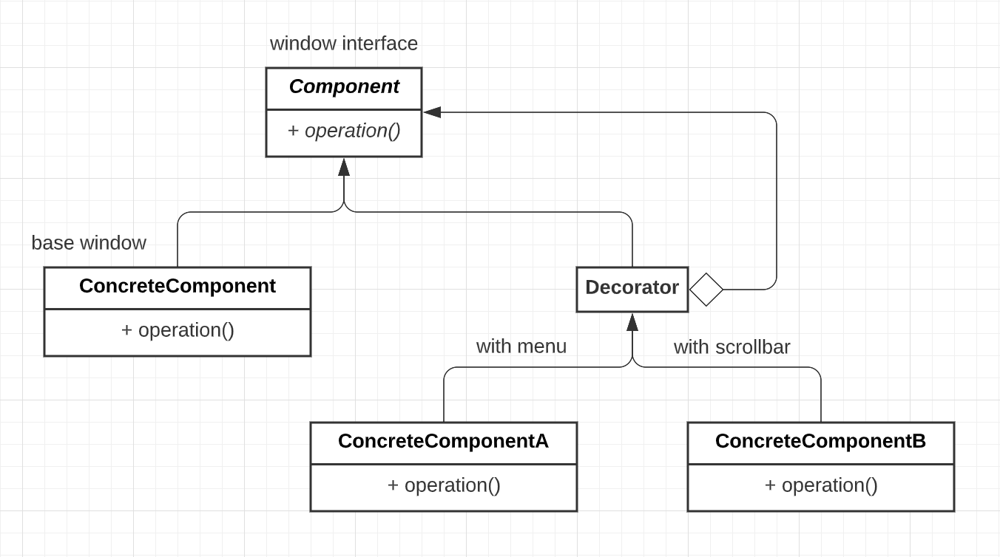

**Class Component** - defines the interface - operations your objects will provide  
**Concrete Component** - implements the interface  
**Decorators** - all inherit from Decorator, which inherits from Component

Therefore, every decorator **is** a component AND every Decorator **has** a component

Window with scrollbar is a kind of window and has a ptr to the underlying plain window

Window with scrollbar & menu **is** a window, has a ptr to a window with scrollar, which has a ptr to window

All inherit from Abstract Window, so window methods can be used polymorphically on all of them

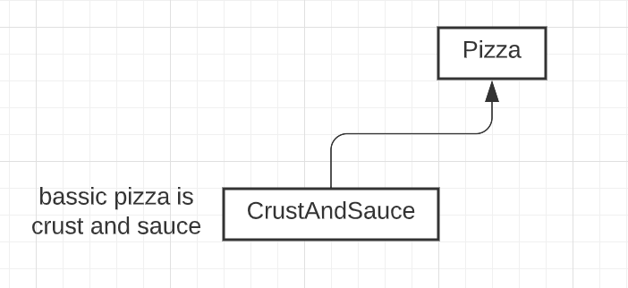

``` c++
// Interface only
class Pizza {
public:
    virtual float price() const = 0;
    virtual string desc() const = 0;
    virtual ~pizza() {};
};

class CrustAndSauce : public Pizza {
public:
    float price() const override {return 5.99;}
    string desc() const override {return "Pizza";}
}
```

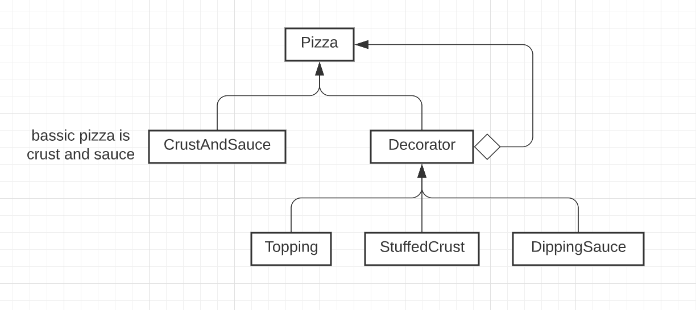

``` c++
class Decorator : public pizza {
protected:
    Pizza *component;
public:
    Decorator(Pizza *p) : component {p} {}
    ~Decorator() {delete component;}
};


class StuffedCrust : public Decorator {
public:
    StuffedCrust(Pizza *p) : Decorator {p} {}
    float price() const override {return component->price() + 2.69;}
    string desc() const override {return component->desc() + "with stuffed crust";}
};


class Topping : public Decorator {
    string theTopping;
public:
    Topping(string topping, Pizza *p) : Decorator {p}, theTopping {topping} {}
    float price() const override {return component->price() + 0.75;}
    string desc() const override {return component->desc() + "with" + theTopping;}
};


Pizza *p1 = new CrustAndSauce;
p1 = new Topping {"cheese", p1};
p1 = new Topping {"mushrooms", p1};
p1 = new StuffedCrust {p1};

cout << p1->desc() << " " << p1->price() << endl;
delete p1;
```


## Observer Pattern
Publish-subscribe model  
One class: publisher/subject - generates data  
One or more subscriber/observer classes - receive data & react to it

Eg: publisher = spreadsheet cell, observers = graphs. When cells change, graphs update

Can be many different kinds of observer(subscriber) objects - subject(publisher) should not need to know all the details

Observer pattern:

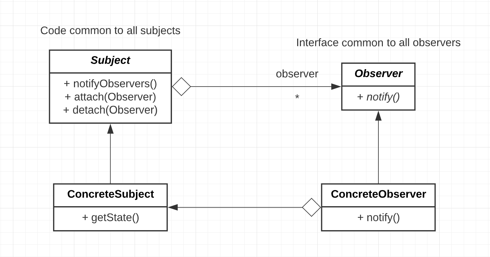

Sequence of method calls:
1. Subject's state is updated
2. `Subject::notifyObservers()` - calls each observer's `notify()`
3. Each observer calls `ConcreteSubject::getState()` to querry the state & reacts accordingly

Example: Horse race  
**Subject** - publishes winner  
**Observer** - individual bettors - declare victory when their horse wins

``` c++
class Subject {
    vector<Observer *> observers;
public:
    void attach(Observer *ob) {observers.emplace_back(ob);}
    void detach(Observer *ob);  // remove from vector
    void notifyObservers() {
        for (auto ob : observers) ob->notify();
    }
    virtual ~Subject() = 0;
}

Subject::~Subject() {}  // .cc file


class Observer {
public:
    virtual void notify() = 0;
    virtual ~Observer() {};
};
```

# Lecture 19
Recall: Observer Pattern
- class Subject
- class Observer

``` c++
class HorseRace : public Subject {
    ifstream in;  // source of data
    string lastWinner;
public:
    HorseRace(string source) : in {source} {}
    bool runRace() {return in >> lastWinner;}
    string getState() {return lastWinner;}
};


class Bettor : public Observer {
    HorceRace *subject;
    string name, myHorse;
public:
    Bettor(...) : ... {subject->attatch(this)};
    void notify() override {
        string winner = subject->getState();
        if (winner == myHorse) cout << "Win!" << endl;
        else cout << "Lose" << endl;
    }
    ~Bettor() {subject->detatch(this);}
};


int main() {
    HorseRace hr;
    Bettor Larry{&hr, "Larry", "RunsLikeACow"};
    // ...  (other bettors)
    while (hr.runRace()) {
        hr.notifyObservers();
    }
}
```

## Factory Method Pattern
Write a video game with 2 kinds of enemies: turtles & bullets
- system randomly sends turtles & bullets, but bullets are more frequent in harder levels
- Never know exactly which enemy comes next, so can't call ctors directly
- Instead, put a **factory method** in Level that cretes enemies

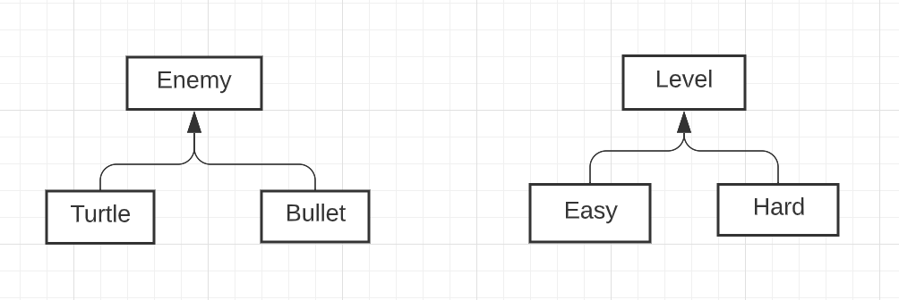

``` c++
class Level {
public:
    // factory method
    virtual Enemy *createEnemy() = 0;
    ...
};


class Easy : public Level {
public:
    Enemy *createEnemy() override {
        // create mostly turtles
    }
};


class Hard : public Level {
public:
    Enemy *createEnemy() override {
        // mostly bullets
    }
};


Level *l = new Easy;
Enemy *e = l->createEnemy();
```

## Template Method Pattern
want subclasses to override superclass behaviour, but some aspects must stay the same

Eg: There are red turtles & green turtles
``` c++
class Turtle {
public:
    void Draw() {
        drawHead();
        drawShell();
        drawFeet();
    }
private:
    void drawHead() {...}
    void drawFeet() {...}
    virtual void drawShell() = 0;
};


class RedTurtle : public Turtle {
    void drawShell() override { /* draw red shells */ }
};


class GreenTurtle : public Turtle {
    void drawShell() override { /* draw green shells */ }
};
```
Subclasses can't change the way a turtle is draw (head, shell, feet), but can change the way the shell is drawn

Private methods in parent class can't be called in child class, but can be override from child class!!!

### Generalizaton - The Non-Virtual Interface (NVI) idiom
A public virtual function is really two things:
- public: an interface to the client
    - indicates promised behaviour (purpose statement)
    - pre/post conditions, class invariants
- virtual: an interface to subclasses
    - subclass can replace this with anything

public & virtual conflict with each other. How can a public virtual method ever keep its promises?

**NVI** says: 
- ***all*** public methods should be non-virtual (except the dtor)
- ***all*** virtual methods should be private (or at least protected)

public virtual method
``` c++
class DigitalMedia {
public:
    virtual void play() = 0;
};
```

transforms to NVI, can add before/after code
``` c++
class DigitalMedia {
public:
    void play() {
        checkCopyright();  // potential behaviour before doPlay()
        doPlay();
        playCount++;  // potential behaviour after doPlay()
    }
private:
    virtual void doPlay() = 0;
};
```

Generalizes Template Method Pattern - puts ***every*** virtual function inside a template method

## STL Maps - for creating dictionaries
Implemented using binary search tree, no hashing of keys. So insertion and retrieve is log(n)

E.g: "arrays" that map strings to int
``` c++
#include <map>

std::map<string, int> m;
m["abc"] = 1;
m["def"] = 4;

cout << m["ghi"] << m["def"];
// if key not present, it is inserted & value is default-constructed (for ints, 0)
// m["ghi"] -> 0
// m["def"] -> 4
```

map functions:
- `m.erase("abc")`
- `if (m.count("def"))` 0 = not found, 1 = found

Iterating over a map => sorted ket order (binary search tree)
``` c++
for (auto &p : m) {
    // fist & second are fields, not function calls
    cout << p.first << " " << p.second << endl;
}
```
p's type is `std::pair<const string, int>` from `#include <utility>`  
since p is lvalue reference here, the actual map can be mutated, but only for p.second (value). p.first (key) cannot be mutated since it's const


## Visitor Pattern
For implementing **double dispatch**

virtual methods - chosen based on the actual type (at runtime) of the receiver object

What if you want to choose based on ***two*** objects?

Eg: striking enemies with weapons

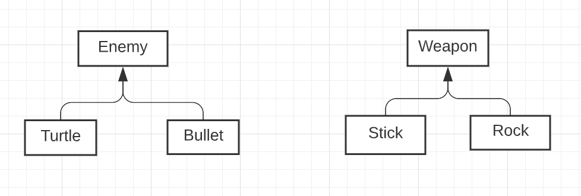

Want something like `virtual void (Enemy, Weapon)::strike();` this is daydreaming, NOT C++

If strike is a method of Enemy, choose based on enemy, but not the weapon  
Similarly, If strike is a method of Weapon, choose based on weapon, but not the enemy

Trick to get dispatch based on both - combination of overriding & overloading

``` c++
class Enemy {
public:
    virtual void beStruckBy(Weapon &w) = 0;
};


class Turtle: public Enemy {
public:
    void beStruckBy(Weapon &w) {w.strike(*this);}  // "*this" is turtle
};


class Bullet: public Enemy {
public:
    void beStruckBy(Weapon &w) {w.strike(*this);}  // "*this" is bullet
};
```

# Lecture 20
## Visitor Pattern ctd.
``` c++
class Weapon {
public:
    virtual void strike(Turtle &t) = 0;
    virtual void strike(Bullet &b) = 0;
};


class Stick: public Weapon {
public:
    void strike(Turtle &t) override {/* strike Turtle with Stick */}
    void strike(Bullet &b) override {/* strike Bullet with Stick */}
};


// Rock is skipped


Enemy *e = new Bullet{...};
Weapon *w = new Rock{...};
e->beStruckBy(*w);  // what happens?

// Bullet::beStrickBy() runs (virtual method dispatch)
// calls Weapon::strick(), "*this" is type Bullet
//     so Bullet version of stike chosen (at compile-time)
// virtual method call resolves to Rock::strike(Bullet &)
```
`*this` will give actual type of the object (Bullet), but `*e` will not (will give Enemy)

**HOW ABOUT FUCNTION THAT RETURNS \*THIS so we can always get true type of e look at cpp_test/proof.cc**

Visitor can be used to add functionality to existing classes, without changing or recompiling the classes themselves

Eg: add a visitor to the Book hierarchy
``` c++
class Book {
public:
    // beStrikeBy
    virtual void accept(BookVisitor &bv) {
        // strike
        bv.visit(*this);
    }
};

class Text: public Book {
public:
    void accept(BookVisitor &bv) override {
        bv.visit(*this);
    }
};
// etc.

class BookVisitor {
public:
    virtual void visit(Book &b) = 0;
    virtual void visit(Text &t) = 0;
    virtual void visit(Comic &c) = 0;
};
```

Application: Track how many of each type of Book we have: Books - by author, Texts - by topic, Comics - by hero

Use a `map<string, int>`  
Could write a virtual method `updateMap()` to each class OR write a visitor

``` c++
struct Catalogue: public BookVisitor {
    map<string, int> theCatalogue;
    void visit(Book &b) {
        ++theCatalogue[b.getAuthor()];
    }
    void visit(Text &t) {
        ++theCatalogue[t.getText()];
    }
    void visit(Comic &c) {
        ++theCatalogue[c.getHero()];
    }
};
```

But it won't compile! Why?
- "main" includes "book" includes "book visitor" includes "text" includes "book" (suspended by `#include guard`)
- circular include dependency. Text doesn't know what Book is

Did we **need** all of those includes?

## Compilation Dependencies
When does a true compilation dependency exist?  
Consider: 
``` c++
// a.h
class A {
    ...
};

// need to know size of A to know size of B & C
// b.h
#include "a.h"
class B: public A {
    ...
};

// c.h
#include "a.h"
class C {
    A a;
};

// ptrs are all the same size
// d.h
class A;
class D {
    A *pa;
};

// just knowing A's existence is good enough for type checking
// e.h
class A;
class E {
    A f(A a);
};

// using knowledge of A's interface
// f.h
#include "a.h"
class F {
    A f(A x) {
        ...
        x.g();
        ...
    }
};
```

If the code doesn't need an include, don't create a needless compilation dependency by including unnecessarily

When class A changes, only A, B, C, F need recompilation

In the **implementation** of D, E:  
d.cc & e.cc:
``` c++
#include "a.h"
void D::f() {
    // need to know about class A
    // a true compilation dependency
    pa->g();
}
```
Do the include in the .cc file instead of the .h file (when possible)

Now consider the XWindow class (from A4)
``` c++
class XWindow {
    // This is private data. Yet we can look at it.
    // Do we know what it all means? Do we care?
    // What if I add or change a private member? All clients must recompile
    // Would be better to hid these details away
    Display *d;
    Window w;
    int s;
    GC gc;
    unsigned long colours[10];
public:
    ...
};
```

Soln: pimpl idiom ("pointer to implementation"). Create a second class XWindowImpl:

XWindowImpl.h:
``` c++
#inlcude <X11/Xlib.h>

struct XWindowImpl {
    Display *d;
    Window w;
    int s;
    GC gc;
    unsigned long colours[10];
};
```

Window.h:
``` c++
class XWindowImpl;
class XWindow {
    XWindowImpl *pImpl;
public:
    ...  // no change
};
```
- No need to include Xlib.h
- forward declare the XWindowImpl class
- No compilation dependency on XWindowImpl.h
- clients also don't depend on XWindowImpl.h

Note: window.cc depend on XWindowImpl.h
Window.cc
``` c++
#include "Window.h
#include "XWindowImpl.h"

XWindow::XWindow(...): pImpl {new XWindowImpl} {...}
```
Other methods - replace fields d, w, s, etc with pImpl->d, pImpl->w, pImpl->s, etc.

If you keep all private fields in XWindowImpl, then only window.cc needs to recompile if you change XWindow's implementation

# Lecture 21
## Measures of Design Quality
- coupling and cohesion

coupling - how much distinct program modules depend on each other  

low:
- modules communicate via function calls with basic params/results
- moduels pass arrays/structs back and forth
- moduels affect each other's control flow  

high: 
- modules have access to each other's implementation (friends)

high coupling
- changes to one module require changes to the other module
- hard to reuse individual modules


cohesion - how closely elements of a module are related to each other

low: 
- arbitrary grouping of unrelated elements (eg. `#include <utility>`)
- elements share a common theme, otherwise unrelated, maybe share base code (eg. `include <algorithm>`)
- elements manipulate state over the lifetime of an object (eg. open/read/close files)
- elements pass data to each other

high:
- elements cooperate to perform exactly one task

low cohesion
- poorly organized code
- hard to understand, reuse

Goal: low coupling, high cohesion


## Decoupling the Interface (MVC)
Your primary program classes should not be printing things

``` c++
class Chess {
    ...
    cout << "Your move";
    ...
};
```

Bad design - inhibits code reuse

What if you want to reuse the ChessBoard, but not have it communicate via stdout?

One solution: give the class stream objects, where it can send it input/output:
``` c++
class Chess {
    istream &in;
    ostream &out;
public:
    ChessBoard(istream &in, ostream &out): in{in}, out{out} {...}
    ...
    out << "Your move";
    ...
};
```

Better - but what if you don't want to use streams at all?

Your ChessBoard class should not be doing any communications at all

### Single Responsibility Principle
A class should only have one reason to change
- game state & communication are **two** responsibilities

Better: Communicate with the ChessBoard via params/results/exceptions
- Confine user communication to outside the class

Q: Should main do all the communicaion & then call ChessBoard methods?  
A: No. It's hard to reuse code if it is in main

Should have a class to manage interactions, that is separate from the game state class

### Architecture: Model-View-Controller (MVC)
Separate the distinct notions of the data (or state - "model"), the presentation of the data ("view") and the control or manipulation of the data

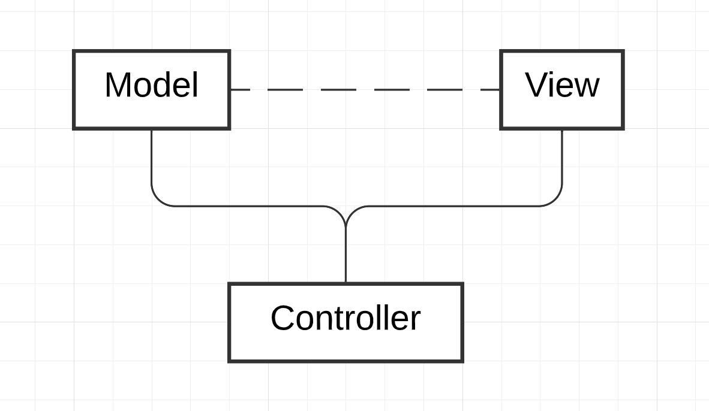

Model
- can have multiple views (eg. text and graphics)
- does not need to know about their details
- classic Observer Pattern (or communicate through controller)

Controller
- mediates control flow through model & view
- might encapsulate turn-taking, or full game results
- might communicate with the user for unput (or thi could be the view)

- By decoupling presentation & control, MVC promotes reuse

### Exception Safety
Considers
``` c++
void f() {
    MyClass mc;
    MyClass *p = new MyClass;
    g();
    delete p;
}
```

No leaks (at first glance) - but what if g() throws?

What is guranteed?
- During stack-unwinding, all stack allocated data is cleaned up
- dtors run, memory reclaimed
- Heap-allocated memory is not destroyed

So if g() throws, mc is not leaked, but p is

``` c++
void f() {
    MyClass mc;
    MyClass *p = new MyClass;
    try {
        g();
    } catch(...) {
        delete p;
        throw;
    }
    delete p;
}
```
This is ugly and error-prone, duplication of code

How else can we gurantee that something (eg. delete p) will happen no matter how we exit f (normal or exception)?

In some languages - "finally" clauses that gurantee certain final actions - **not** in C++

Only thing you can count on in C++, dtors for stack-allocated data will run

Use stack-allocated data with dtors as much as possible - use the gurantee to your advantage

**C++ idion**: RAII - Resource Acquisition Is Initialization
- Every resource should be wrapped in a stack-allocated object, whose job is to delete it

Eg. fiels
``` c++
{
    istream f {"file"};  // acquiring the resource (file) = initializing f
    // the file is guranteed to be closed when f is popped from the stack (f's dtor runs)
}
```

This can be done with dynamic memory: `class std::unique_ptr<T>` in `#include <memory>`
- takes a T* in the ctor
- dtor deletes the ptr
- in between - dereference, just like a ptr

``` c++
void f() {
    MyClass mc;
    unique_ptr<MyClass> p {new MyClass};
    // OR auto p = std::make_unique<MyClass>(ctor args);
    g();
    // No leaks guranteed
}
```


# Lecture 22
Recall:
``` c++
void f() {
    MyClass mc;
    unique_ptr<MyClass> p {new MyClass};
    // OR auto p = std::make_unique<MyClass>(ctor args);
    g();
    // No leaks guranteed
}
```

Difficulty:
``` c++
class C {...};
...
unique_ptr<C> p {new C {...}};
unique_ptr<C> q = p;  // wrong
```
can't copy a unique_ptr - don't want to delete the same obj twice  
Copying is disabled for unique_ptrs. They can only be moved

Sample implementation
``` c++
template <typename T> class unique_ptr {
    T *ptr;
public:
    explicit unique_ptr (T *p): ptr{ptr} {}
    ~unique_ptr() {delete ptr;}
    unique_ptr(const unique_ptr &other) = delete;
    unique_ptr & operator= (const unique_ptr &other) = delete;
    unique_ptr(unique_ptr &&other): ptr{other.ptr} {other.ptr = nullptr;}
    unique_ptr & operator= (unique_ptr &&other) {
        std::swap(ptr, other.ptr);
        return *this;
    }
    T & operator*() {return *ptr;}
    T* get() {return ptr;}
    ...
};
```

If you need to be able to copy ptrs, first answer the question of **ownership**
- Who will own the resource? Who has responsibility for freeing it?
    - That ptr should be a unique_ptr. All other ptrs should be raw ptrs (can fetch this with `p.get()`)

If there is true shared ownership (ie: any of several ptrs might need to free the resource) - use `std::shared_ptr`

``` c++
{
    auto p1 = std::make_shared<MyClass>();
    if (...) {
        auto p2 = p1;
    }  // p2 popped, ptr NOT deleted
}  // p1 popped, ptr IS deleted
```
shared_ptrs maintain a reference count - count of all shared_ptrs pointing at the same obj  
Memory is freed when count of shared_ptrs pointing to it is about to reach 0

Use the type of ptr that accurately reflects the ptr's ownership role  
*Dramatically* fewer opportunities for leaks

## Exception safety ctd.
3 levels of exception safety for a function f:
1. Basic guarantee - if an exception occurs, the program will still be in some valid state
    - nothing leaked, no corrupted data structures, all class invariants maintained
2. Strong guarantee - if an exception is raised while executing f, the state of the program will be as if f had not been called (f is either fully done or not at all, f can never be half-done)
3. No-throw guarantee - f will never throw or propagate an exception, and will always accomplish its task

Eg:
``` c++
class A {...};
class B {...};
class C {
    A a;
    B b;
    void f() {
        // both of these mat throw (strong gurantee)
        a.g();
        b.h();
    }
};
```
Is f exception safe?
- If a.g() throws, nothing has happened yet, f propagate the exception. OK (strong guarantee)
- If b.h() throws, effects of g() would have to be undone to offer the strong guarantee
    - very hard or impossible if g() has non-local side-effects

No, probably not exception safe

Assume g() and h() do not have non-local side-effects  
Can use copy & swap

``` c++
class C {
    ...
    void f() {
        // If one of following 4 lines throws, original a & b still intact
        A atmp = a;
        B btmp = b;
        atmp.g();
        btmp.h();
        // What if following 2 lines throws? Not exception safe
        a = atmp;
        b = btmp;
    }
};
```

Better if the "swap" part of copy assignment  was no-throw. Copying ptrs cannot throw.  
Soln: pImpl idiom

``` c++
struct CImpl {
    A a;
    B b;
};
class C {
    unique_ptr<CImpl> pImpl;
    void f() {
        auto tmp = make_unique<CImpl>(*pImpl);
        tmp->a.g();
        rmp->b.h();
        std::swap(pImpl, tmp);  // no-throw
    }
};
```

If either A::g or B::h offers no exception safety gurantee, then neither can f

## Exception safety of the STL - vectors
vectors - encapsulate a heap-allocated array
- follows RAII - when a stack-allocated vector goes out of scope, the internal heap allocated array is freed

``` c++
void f() {
    vector<MyClass> v;
    ...
}  // v goes out of scope - array is freed, MyClass dtor runs on all objs in the vector
```

But
``` c++
void g() {
    vector<MyClass*> v;
    ...
}
// array is freed, ptrs don't have dtors, so any objs pointed to by the ptrs are NOT deleted
// v doesn't know whether the ptrs in the array OWN the objs they point at
//      if OWNS -> for (auto x : v) delete x;
```

But
``` c++
void g() {
    vector<unique_ptr<MyClass>> v;
    ...
}
// array is freed, unique ptr dtor runs, so the objs ARE deleted
// NO explicit deallocation
```

`vector<T>::emplace_back()`
- offers the strong guarantee
- if array is full (ie. size == cap)
    - allocate new array
    - copy objs over (copy ctor)
        - if a copy ctor throws
        - destroy the new array
        - original still inatct
        - strong guarantee
    - swap ptrs (no-throw)
    - delete the old array (no-throw, since all dtors are no-throw guranteed)

But
- copy is expensive & the old data will be thrown away
- `move` instead of `copy`?


# Lecture 23
continue with `vector<T>::emplace_back()`, copying is expensive & the old data will be thrown away

move instead of copy?
- if move ctor throws, can't offer the strong gurantee - original no longer intact

If the move ctor offers the no-throw guarantee, emplace_back() will use the move ctor. Otherwise it uses the copy ctor(slower)

So, your move operations should provide the no-throw guarantee, and you should indicate that they do

``` c++
class MyClass {
public:
    MyClass(MyClass &&other) noexcept {...}
    MyClass &operator=(MyClass &&other) noexcept {...}
};
```

If you know that a function will never throw or propagate an exception, declare it `noexcept`

Facilitates optimization  
At minimum: move & swap should be `noexcept`

## Casting
in C:
``` c
Node n;
int *ip = (int*) &n;  // cast - forces to treat a Node* as an int*
```

C-style casts should be avoided in C++. If you **must** cast, use a C++ cast

There are 4 ways for casting

### static_cast
For casts with a well defined meaning

double -> int
``` c++
double d;
void f(int x);
void f(double x);
f(d);  // double f
f(static_cast<int>(d));  // int f
```

superclass ptr -> subclass ptr
``` c++
Book *b = new Text{...};
Text *t = static_cast<Text*>(b);
t->getTopic();
```
You are taking responsibility that b actually points at a Text. "Trust me"

Casting into wrong type will cause **undefined behaviour**!!!

### reinterpret_cast
Unsafe implementation specific, "weird" conversions

``` c++
Student s;
Turtle *t = reinterpret_cast<Turtle*>(&s);
```

### const_cast
For converting between const & non-const
- the ***only*** C++ cast that can "cast away" const

``` c++
void g(int *p);  // suppose you know that g won't actually mutate *p
void f(const int *p) {
    g(const_cast<int*>(p));
}
```

```
|--------------------------|------------------------------------|
|      const-correct       |      doesn't use const at all      |
|--------------------------|------------------------------------|
```
When integrating two programs (one is const-correct, one doesn't use const at all), use const_cast as a easy solution. Instead of changing everything in the rigth half to const-correct.

### dynamic_cast
Is it safe to convert a `Book*` to a `Text*`?

``` c++
Book *pb = new Book{...};
static_cast<Text*>(pb)->getTopic();  // safe?
                                     // depends on what pb actually points at
```
Better to do a tentative cast - try it and see if it works `Text *pt = dynamic_cast<Text*>(pb);`

If the cast works (ie: *pb really is a Text, or a subclass of Text), pt points at the object  
If the cast fails, pt will be nullptr
``` c++
if (pt) {
    cout << pt->getTopic();
} else {
    cout << "Not a Text";
}
```

Why still use static_cast when we have dynamic_cast?  
Cuz dynamic_cast is expensive and static_cast is pretty much free.

These are operations on raw ptr. Can we do this with smart ptrs?  
Yes, `static_pointer_cast`, `dynamic_pointer_cast` cast shared_ptrs to shared_ptrs. `const_pointer_cast` and `reinterpret_pointer_cast` also exist, but likely never going to be used.

Why are there no casting for unique_ptr?  
Cuz then there will be two unique_ptrs pointing to the same object in memory, this is NOT allowed

Consider:
``` c++
void whatIsIt(Book *b) {
    if (dynamic_cast<Text*>(b)) {
        cout << "Text";
    } else if (dynamic_cast<Comic*>(b)) {
        cout << "Comic";
    } else {
        cout << "Book";
    }
}
```

Code like this is tightly coupled to the Book class hierarchy & may indicate bad design

Better: use virtual methods or write a visitor

Dynamic casting also works with refs:
``` c++
Text t{...};
Book &b = t;
Text &t2 = dynamic_cast<Text&>(b);
// If b "points to" a Text, then t2 is a ref to the same Text
```
If not? (No null refs) - throws `std::bad_cast`

Note: dynamic casting only works on classes with at least one virtual method (so compiler can check if two function calls are the same)

With dynamic reference casting, we can "solve" the polymorphic assignment problem

``` c++
Text & Text::&operator= (const Book &other) {  // virtual in Book
    // throws std::bad_cast if other is not a Text
    const Text &textOther = dynamic_cast<const Text*>(other);
    if (this == &other) return this;
    Book::operator=(other);
    topic = textOther.topic;
    return *this;
}
```

## How virtual methods work
``` c++
class Vec {
    int x, y;
public:
    int f() {...}
};

class Vec2 {
    int x, y;
public:
    virtual int f() {...}
};

// what's the difference?
// do these look the same in memory?
Vec v{1, 2};
Vec2 w{1, 2};

cout << sizeof(v) << ' ' << sizeof(w); // 8 16 ???
```
First note: 8 is space for 2 ints
- No space for f() method

Compiler turns methods into ordinary functions & stores them separately from objs

Recall:
``` c++
Book *pb = new Book/Text/Comic;
pb->isHeavy();
// If isHeavy() is virtual, choice of which version to run is based on the type of the actual obj
// which the compiler can't know in advance
```

# Lecture 24
Recall: How virtual methods work  
correct is isHeavy must be chosen at run-time

How about
``` c++
class C {
    int x, y;
    virtual void f();
    virtual void g();
    void h();
    virtual ~C();
};

```

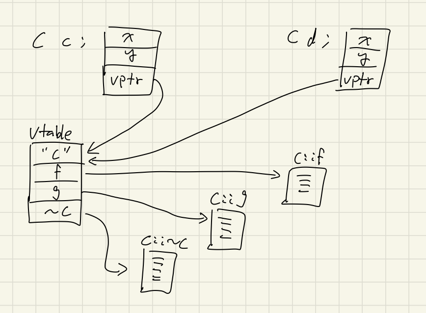

For each class with virtual methods, the compiler creates a table of function pointers (the vtable)

C (class, not language) objects have an extra ptr (the vptr) that pts to C's vtable

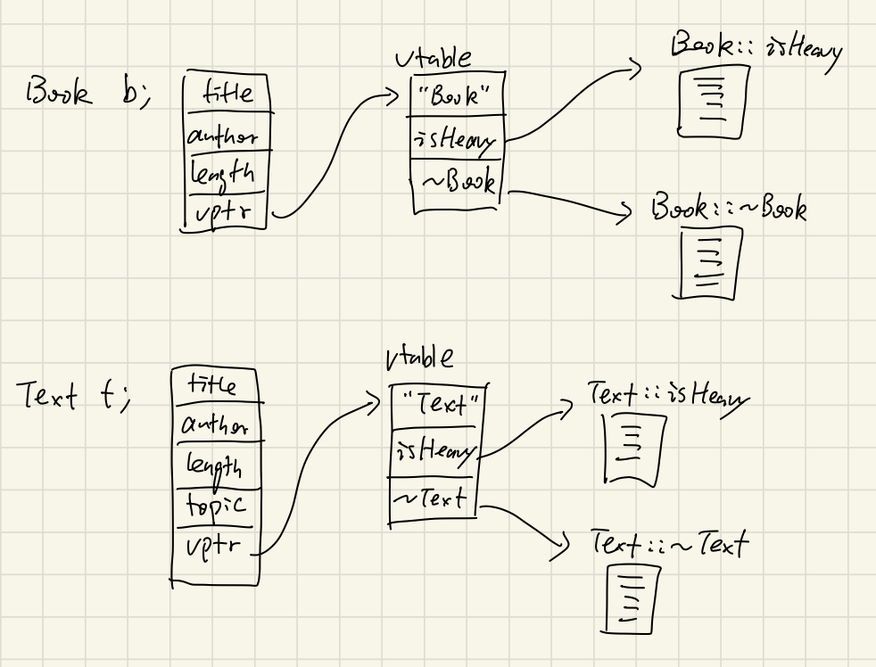

Calling a virtual method: (at run time)
- follor vptr to vtale
- fetch ptr to actual method from table
- follow the function ptr & call the function

therefore, virtual function calls leads to a small overhead cost

Also, having >= 1 virtual functions adds a vptr to the obj  
therefore, classes with virtual methods produces larger objects than if there were no virtual methods => **space cost**

Concretely, how is an object laid out? Compiler-dependent

``` c++
class A {
    int a, c;
    virtual void f();
};

class B: public A {
    int b, d;
};
```

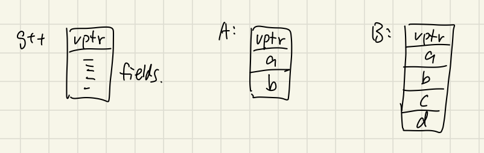

so ptr to B looks like a ptr to A, if you ignore the last two fields


- also, making it first means it's always in the same place => you can find such that no matter what kind of object you have

## Multiple Inheritance
A class can inherit from more than one class
``` c++
class A {
    int a;
};

class B {
    int b;
};

class C: public A, public B {
    void f() {
        cout << a << ' ' << b;
    }
};
```

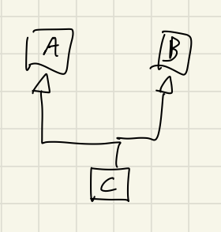

challenges: Suppose B & C inherit from A

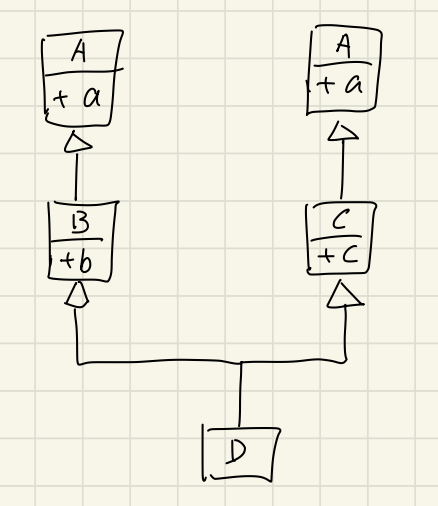

``` c++
class D: public B, public C {
public:
    int d;
};

D d;
d.a;  // which a is this? Ambiguous - compiler rejects
```

Need to specify d.B::a or d.C::a

But if B & C inherit from A, should there be one A part of D or two? By default it's two. Should B::a and C::a be the same or different?

deadly diamond

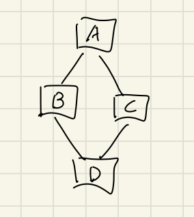

Make A a **virtual bass class** - **virtual inheritance**:
``` c++
class B: virtual public A {
    ...
};

class C: virtual public A {
    ...
};
```


Eg: IO streams

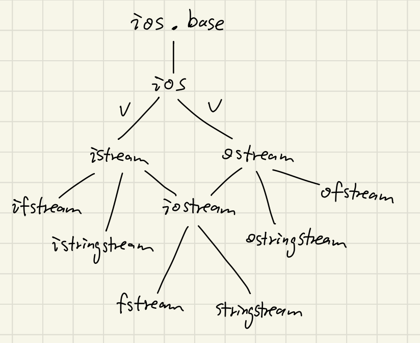

How will this be laid out:

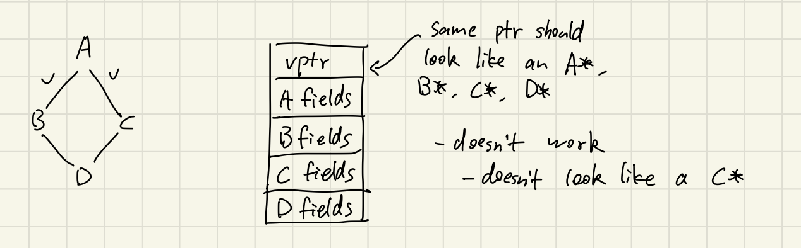

What does g++ do?

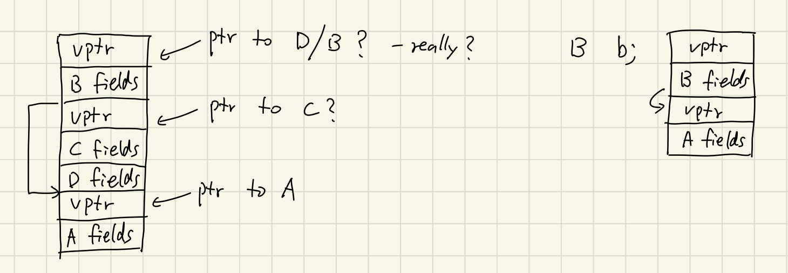

B needs to be laid out so that we can find its A part, but the distance is unknown

Solution: location of the base class object is stored in the vtables

Disgram doesn't look like all of A, B, C, D simultaneously... but slices of it looks like A, B, C, D  

therefore, ptr assignment among A, B, C, D changes the addr stored in the ptr
``` c++
D *d = new D;
A *a = d;  // value of the ptr adjusted by the offset to the A part
```
static_cast & dynamic_cast will make this adjustment, reinterpret_cast will not


## Template Functions
``` c++
template <typename T> T min(T x, T y) {
    return x < y ? x : y;
}

int f() {
    int x = 1, y = 3;
    int z = min(x, y);  // T is int
    // Don't have to say min<int>. C++ infers T = int from the types of x & y
}
```

can say `max<int>` if you want
``` c++
min('a', 'c')  // T = char
min(1.0, 3.0)  // T = double
```

For what types T can min be used? For what types T does the body compiler? Any type for which `operator<` is defined

Recall:
``` c++
void foreach(AbstractIterator start, AbstractIterator finish, int(*f)(int)) {
    while (start != finish) {
        f(*start);
        ++start;
    }
}
```

Works as long as
- AbstractIterator supports !=, *, ++
- f can be called as a function
- Make these template args

``` c++
template<typename Iter, typename Fn> void foreach(Iter start, Iter finish, Fn f) {
    while (start != finish) {
        f(*start);
        ++start;
    }
}
```

Now Iter can be **any** type (not just AbstractIterator) that supports !=, ++, * (including raw ptrs)

``` c++
void f(int n) {
    cout << n << endl;
}

int a[] = {1, 2, 3, 4, 5};

foreach(a, a + 5, f);  // prints the array
```

C++ `<algorithm>` library
- suite of template functions, many of which work over iterators
